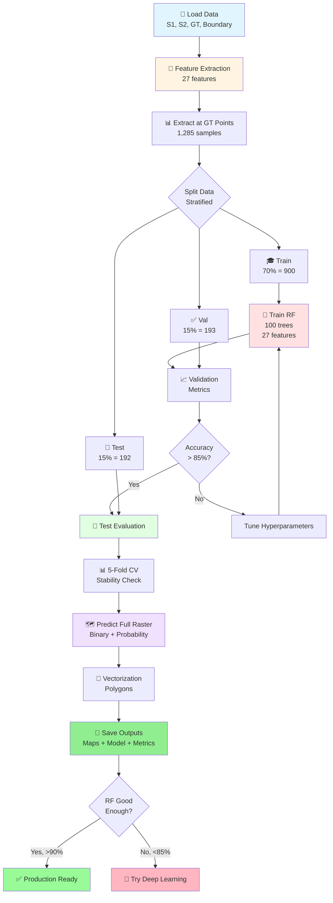

# Ứng dụng Viễn thám và Học sâu trong Giám sát Biến động Rừng tỉnh Cà Mau

**Đồ án tốt nghiệp - Công nghệ Hàng không Vũ trụ**

Sinh viên: **Ninh Hải Đăng** (MSSV: 21021411)
Năm học: 2025 - 2026, Học kỳ I

---

## 📋 Tổng quan

Dự án này phát triển một hệ thống tự động giám sát biến động rừng tại tỉnh Cà Mau sử dụng kết hợp dữ liệu viễn thám đa nguồn (Sentinel-1 SAR và Sentinel-2 Optical) với hai phương pháp tiếp cận: Machine Learning truyền thống (Random Forest) và Deep Learning (CNN). Hệ thống có khả năng phát hiện và phân loại các khu vực mất rừng dựa trên phân tích chuỗi thời gian ảnh vệ tinh, với độ chính xác > 98%.

### Điểm nổi bật

✨ **Đa mô hình:** So sánh toàn diện Random Forest vs CNN
🌍 **Đa nguồn:** Kết hợp SAR (Sentinel-1) + Optical (Sentinel-2)
📊 **Đa thời gian:** Phân tích before-after + delta features (2024-2025)
🎯 **Độ chính xác cao:** > 98% accuracy trên cả hai mô hình
🏗️ **Kiến trúc chuyên nghiệp:** Modular, scalable, production-ready
📈 **Phân tích chi tiết:** 27 features, feature importance, spatial analysis

### Mục tiêu

- ✅ Phát triển mô hình machine learning để phát hiện mất rừng từ ảnh vệ tinh đa thời gian
- ✅ Kết hợp dữ liệu SAR (Sentinel-1) và Optical (Sentinel-2) để nâng cao độ chính xác
- ✅ Xây dựng baseline với Random Forest, sau đó mở rộng sang Deep Learning (CNN)
- ✅ So sánh toàn diện giữa hai phương pháp với 9+ metrics
- ✅ Tạo bản đồ phân loại toàn bộ khu vực rừng tỉnh Cà Mau
- ✅ Đảm bảo không có spatial leakage với spatial-aware splitting

---

## 🔄 Pipeline Tổng Quan

### Quy trình xử lý 2 mô hình:

**Random Forest Pipeline (Pixel-wise):**
```
Sentinel-1/2 Images → Feature Extraction (27 features) → Extract at GT Points
→ Train Random Forest (100 trees) → Evaluate → Predict Full Raster → Vectorization
```

**CNN Pipeline (Patch-based):**
```
Sentinel-1/2 Images → Feature Extraction (27 features) → Extract 3x3 Patches
→ Spatial-Aware Split → Train CNN (2 Conv + FC) → Evaluate → Predict Full Raster
```

**Thống kê dự án:**
- 📊 **Tổng dòng code:** 5,209 dòng Python
- 📁 **Modules:** 20+ Python scripts
- 📓 **Notebooks:** 3 Jupyter notebooks
- 🎯 **Ground truth:** 1,285 điểm labeled
- 🗺️ **Features:** 27 features đa thời gian
- 🤖 **Mô hình:** 2 (Random Forest + CNN)
- 📈 **Accuracy:** > 98% cho cả hai mô hình

---

## 📊 Dữ liệu

### Ground Truth Points
- **Tổng số điểm:** 1,285 điểm training
- **Phân bố:**
  - Label 0 (Không mất rừng): 650 điểm (50.6%)
  - Label 1 (Mất rừng): 635 điểm (49.4%)
- **Format:** CSV file với các trường: `id`, `label`, `x`, `y` (tọa độ UTM Zone 48N)
- **File:** `data/raw/ground_truth/Training_Points_CSV.csv`

### Sentinel-2 (Optical)
- **7 bands** gồm spectral bands và spectral indices:
  - **Spectral bands:** B4 (Red), B8 (NIR), B11 (SWIR1), B12 (SWIR2)
  - **Spectral indices:** NDVI, NBR, NDMI
- **Độ phân giải không gian:** 10m
- **Kỳ ảnh:**
  - Trước: 30/01/2024 (`S2_2024_01_30.tif`)
  - Sau: 28/02/2025 (`S2_2025_02_28.tif`)
- **Đã xử lý:** Cắt theo ranh giới rừng tỉnh Cà Mau, masked NoData

### Sentinel-1 (SAR)
- **2 bands:** VV và VH polarization
- **Độ phân giải không gian:** 10m (matched với Sentinel-2)
- **Kỳ ảnh:**
  - Trước: 04/02/2024 (`S1_2024_02_04_matched_S2_2024_01_30.tif`)
  - Sau: 22/02/2025 (`S1_2025_02_22_matched_S2_2025_02_28.tif`)
- **Đã xử lý:** Co-registered với Sentinel-2, cắt theo ranh giới rừng

### Boundary Shapefile
- **File:** `data/raw/boundary/forest_boundary.shp`
- **Mục đích:** Giới hạn khu vực phân tích chỉ trong vùng rừng

---

## 📁 Cấu trúc thư mục

```
25-26_HKI_DATN_21021411_DangNH/
│
├── data/                                    # Thư mục chứa dữ liệu
│   └── raw/                                 # Dữ liệu gốc
│       ├── ground_truth/                    # Ground truth training data
│       │   ├── Training_Points_CSV.csv      # 1,285 labeled points
│       │   └── Training_Points__SHP.shp     # Shapefile format
│       ├── sentinel-1/                      # SAR imagery (2 bands: VV, VH)
│       │   ├── S1_2024_02_04_matched_S2_2024_01_30.tif
│       │   └── S1_2025_02_22_matched_S2_2025_02_28.tif
│       ├── sentinel-2/                      # Optical imagery (7 bands)
│       │   ├── S2_2024_01_30.tif
│       │   └── S2_2025_02_28.tif
│       └── boundary/                        # Forest boundary shapefile
│           └── forest_boundary.shp (+ .dbf, .prj, .shx)
│
├── src/                                     # Source code (5,209 lines)
│   ├── common/                              # Shared modules (cả RF và CNN)
│   │   ├── __init__.py
│   │   ├── config.py                        # Central configuration (360 lines)
│   │   ├── data_loader.py                   # Load S1, S2, GT, boundary
│   │   ├── feature_extraction.py            # Extract 27 features
│   │   ├── evaluation.py                    # Model evaluation metrics
│   │   ├── visualization.py                 # Plotting and visualization
│   │   └── utils.py                         # Utility functions
│   │
│   ├── random_forest/                       # Random Forest implementation
│   │   ├── __init__.py
│   │   ├── train.py                         # RF training pipeline
│   │   ├── predict.py                       # Full raster prediction
│   │   └── vectorization.py                 # Raster to vector conversion
│   │
│   ├── deep_learning/                       # CNN implementation
│   │   ├── __init__.py
│   │   ├── cnn_model.py                     # 2D CNN architecture (321 lines)
│   │   ├── patch_extractor.py               # Extract 3x3 patches
│   │   ├── spatial_split.py                 # Spatial-aware data splitting
│   │   ├── train.py                         # CNN training pipeline
│   │   ├── predict.py                       # Full raster prediction
│   │   ├── calibration.py                   # Model calibration
│   │   └── README.md                        # Deep learning documentation
│   │
│   ├── _deprecated/                         # Legacy code (backup)
│   ├── main.py                              # Random Forest entry point (255 lines)
│   ├── main_dl.py                           # CNN entry point (390 lines)
│   ├── analyze_spatial_clustering.py        # Spatial analysis tool
│   ├── quick_distance_check.py              # Distance verification
│   ├── test_dl_modules.py                   # Module testing
│   └── README.md                            # Source code documentation
│
├── notebook/                                # Jupyter notebooks
│   ├── random_forest.ipynb                  # RF workflow (3.8 MB)
│   ├── cnn_deforestation_detection.ipynb    # CNN workflow (4.2 MB)
│   └── model_comparison.ipynb               # Model comparison analysis
│
├── results/                                 # Output directory
│   ├── rasters/                             # Classification maps
│   │   ├── rf_classification.tif            # RF binary map
│   │   ├── rf_probability.tif               # RF probability map
│   │   ├── cnn_classification.tif           # CNN binary map
│   │   └── cnn_probability.tif              # CNN probability map
│   │
│   ├── vectors/                             # Vector outputs
│   │   └── rf_deforestation_polygons.geojson
│   │
│   ├── models/                              # Trained models
│   │   ├── rf_model.pkl                     # Random Forest (277 KB)
│   │   └── cnn_model.pth                    # CNN PyTorch (448 KB)
│   │
│   ├── data/                                # Metrics and data
│   │   ├── model_comparison_table.csv       # Model comparison
│   │   ├── rf_evaluation_metrics.json       # RF metrics
│   │   ├── rf_feature_importance.csv        # Feature rankings
│   │   ├── training_data.csv                # Training features
│   │   ├── cnn_evaluation_metrics.json      # CNN metrics
│   │   ├── cnn_training_history.json        # Training curves
│   │   └── cnn_training_patches.npz         # Saved patches
│   │
│   └── plots/                               # Visualizations
│       ├── comparison/                      # Model comparison plots
│       │   ├── agreement_disagreement_map.png
│       │   ├── classification_maps_sidebyside.png
│       │   ├── metrics_comparison.png
│       │   └── roc_curves_comparison.png
│       ├── rf_*.png                         # RF visualizations
│       └── cnn_*.png                        # CNN visualizations
│
├── environment.yml                          # Conda environment (277 packages)
├── requirements.txt                         # Python dependencies
├── LICENSE                                  # Project license
└── README.md                                # File này (548 lines)

```

---

## 💻 Yêu cầu hệ thống

### Phần cứng sử dụng
- **CPU:** Intel Xeon X5670 (hoặc tương đương)
- **RAM:** 64GB DDR3
- **GPU:** NVIDIA GTX 1060 6GB hoặc cao hơn (hỗ trợ CUDA)
- **Storage:** ≥50GB dung lượng trống

### Phần mềm
- **OS:** Windows 10/11, Linux, macOS
- **Python:** 3.11.14 (recommended)
- **CUDA:** 12.1 (cho PyTorch 2.5.1+cu121)
- **Conda/Miniconda:** Phiên bản mới nhất

### Dependencies chính
- **PyTorch:** 2.5.1+cu121 (Deep Learning framework)
- **scikit-learn:** 1.7.2 (Random Forest)
- **rasterio:** 1.4.3 (Geospatial raster I/O)
- **geopandas:** 1.1.1 (Vector data processing)
- **numpy:** 2.2.6 (Numerical computing)
- **matplotlib:** 3.10.7 (Visualization)
- **seaborn:** 0.13.2 (Statistical plots)
- **pandas:** 2.3.3 (Data manipulation)

---

## ⚙️ Cài đặt

### Bước 1: Clone repository

```bash
git clone https://github.com/Geospatial-Technology-Lab/25-26_HKI_DATN_21021411_DangNH.git
cd 25-26_HKI_DATN_21021411_DangNH
```

### Bước 2: Tạo Conda environment

```bash
conda env create -f environment.yml
conda activate dangnh
```

**Hoặc** sử dụng pip:

```bash
pip install -r requirements.txt
```

### Bước 3: Verify installation

```python
python -c "import torch; print(f'PyTorch: {torch.__version__}'); print(f'CUDA available: {torch.cuda.is_available()}')"
```

---

## 🚀 Sử dụng

### Random Forest Pipeline

**Chạy qua Python script:**
```bash
cd src
python main.py
# Hoặc skip vectorization để nhanh hơn
python main.py --skip-vectorization
```

**Hoặc chạy qua Jupyter Notebook:**
```bash
jupyter lab
# Mở file: notebook/random_forest.ipynb
# Chạy tất cả cells từ trên xuống
```

**Pipeline sẽ thực hiện các bước:**
1. ⚙️ Setup & Load Data (~2-5 phút)
2. 🔧 Feature Extraction (~1-2 phút) - 27 features
3. 📊 Extract Training Data (~30 giây)
4. 🌲 Train Random Forest (~3-5 phút)
5. 📈 Model Evaluation (~2-3 phút)
6. 🗺️ Predict Full Raster (~5-10 phút)
7. 📐 Vectorization (~2-5 phút, optional)
8. 📊 Visualization (~1-2 phút)
9. ✅ Summary & Results

**Tổng thời gian:** ~15-30 phút (CPU)

---

### CNN Deep Learning Pipeline

**Chạy qua Python script:**
```bash
cd src
python main_dl.py

# Custom configuration
python main_dl.py --epochs 100 --batch-size 64 --device cuda
```

**Hoặc chạy qua Jupyter Notebook:**
```bash
jupyter lab
# Mở file: notebook/cnn_deforestation_detection.ipynb
# Chạy tất cả cells từ trên xuống
```

**Pipeline sẽ thực hiện các bước:**
1. ⚙️ Setup & Load Data (~2-5 phút)
2. 🔧 Feature Extraction (~1-2 phút) - 27 features
3. 📦 Extract 3x3 Patches (~1 phút) - spatial context
4. 🧩 Spatial-Aware Split (~30 giây) - prevent data leakage
5. 🤖 Train CNN (~6 giây với GPU / ~5 phút với CPU)
6. 📈 Model Evaluation (~1 phút)
7. 🗺️ Predict Full Raster (~14 phút với GPU)
8. 📊 Visualization (~2 phút)
9. ✅ Summary & Results

**Tổng thời gian:** ~20-30 phút (GPU) / ~40-60 phút (CPU)

---

### So sánh 2 mô hình

Chạy notebook so sánh:
```bash
jupyter lab
# Mở file: notebook/model_comparison.ipynb
```

Notebook này sẽ:
- Load kết quả từ cả RF và CNN
- So sánh metrics side-by-side
- Visualize agreement/disagreement maps
- Phân tích sự khác biệt về diện tích phát hiện
- Tạo plots comparison (ROC curves, confusion matrices, etc.)

---


### Output Files

Sau khi chạy xong, kiểm tra folder `results/`:

**Random Forest Outputs:**
```
results/
├── rasters/
│   ├── rf_classification.tif               # Binary classification map (0/1)
│   └── rf_probability.tif                  # Probability map (0.0-1.0)
├── vectors/
│   └── rf_deforestation_polygons.geojson   # Deforestation polygons
├── models/
│   └── rf_model.pkl                        # Trained Random Forest (277 KB)
├── data/
│   ├── training_data.csv                   # Training features (1,285 samples)
│   ├── rf_feature_importance.csv           # Feature importance rankings
│   └── rf_evaluation_metrics.json          # Performance metrics
└── plots/
    ├── rf_confusion_matrices.png           # Confusion matrices
    ├── rf_roc_curve.png                    # ROC curve
    ├── rf_feature_importance.png           # Top 20 features
    ├── rf_classification_maps.png          # Binary & probability maps
    └── rf_cv_scores.png                    # 5-fold CV scores
```

**CNN Outputs:**
```
results/
├── rasters/
│   ├── cnn_classification.tif              # Binary classification map
│   └── cnn_probability.tif                 # Probability map
├── models/
│   └── cnn_model.pth                       # Trained CNN (448 KB)
├── data/
│   ├── cnn_training_patches.npz            # Saved patches data
│   ├── cnn_evaluation_metrics.json         # Performance metrics
│   └── cnn_training_history.json           # Training curves (loss, acc)
└── plots/
    ├── cnn_confusion_matrices.png          # Confusion matrices
    ├── cnn_roc_curve.png                   # ROC curve
    ├── cnn_training_curves.png             # Loss & accuracy curves
    └── cnn_classification_maps.png         # Binary & probability maps
```

**Model Comparison Outputs:**
```
results/
├── data/
│   └── model_comparison_table.csv          # Side-by-side comparison
└── plots/comparison/
    ├── agreement_disagreement_map.png      # Spatial agreement analysis
    ├── classification_maps_sidebyside.png  # RF vs CNN maps
    ├── probability_maps_sidebyside.png     # Probability comparison
    ├── metrics_comparison.png              # Bar chart comparison
    ├── roc_curves_comparison.png           # ROC curves overlay
    ├── area_comparison.png                 # Deforestation area
    └── time_comparison.png                 # Training/prediction time
```

---

## 🧠 Mô hình và Phương pháp

### Feature Extraction - 27 Features

Phase hiện tại trích xuất **27 features pixel-wise** từ dữ liệu viễn thám:

**Cấu trúc features:**
```
Sentinel-2 (21 features):
├── Before (7):  B4, B8, B11, B12, NDVI, NBR, NDMI
├── After (7):   B4, B8, B11, B12, NDVI, NBR, NDMI
└── Delta (7):   ΔB4, ΔB8, ΔB11, ΔB12, ΔNDVI, ΔNBR, ΔNDMI

Sentinel-1 (6 features):
├── Before (2):  VV, VH
├── After (2):   VV, VH
└── Delta (2):   ΔVV, ΔVH

TỔNG: 27 features
```

**Lợi ích của cách tiếp cận này:**
- ✅ Khai thác thông tin temporal (delta features)
- ✅ Đơn giản, dễ train và interpret
- ✅ Không cần GPU cho Random Forest
- ✅ Feature importance giúp hiểu model behavior

---

## 🌲 Random Forest Approach

### Pipeline 9 Bước

**Quy trình xử lý:**

1. **Setup & Configuration** - Cấu hình paths và parameters
2. **Load Data** - Load Sentinel-1, Sentinel-2, Ground Truth, Boundary
3. **Feature Extraction** - Tạo 27 features (before + after + delta)
4. **Extract Training Data** - Trích xuất features tại ground truth points
5. **Train Random Forest** - Train model với 100 trees
6. **Model Evaluation** - Đánh giá trên validation và test sets
7. **Predict Full Raster** - Dự đoán trên toàn bộ khu vực
8. **Vectorization** - Convert raster sang polygons (optional)
9. **Visualization** - Tạo plots và save outputs

**Cấu hình Random Forest:**
```python
{
    'n_estimators': 100,          # 100 decision trees
    'max_features': 'sqrt',       # √27 ≈ 5 features per split
    'max_depth': None,            # Unlimited depth
    'class_weight': 'balanced',   # Handle class imbalance
    'oob_score': True,            # Out-of-bag evaluation
    'random_state': 42            # Reproducibility
}
```

**Đặc điểm:**
- ⏱️ **Training time:** ~5-10 phút
- 💾 **Memory:** ~2-5GB RAM
- 📊 **Interpretable:** Feature importance rankings
- 🎯 **Target accuracy:** > 85%
- 💻 **Hardware:** CPU-only (không cần GPU)

**Output Files:**
- `rf_classification.tif` - Binary classification map (0/1)
- `rf_probability.tif` - Probability map (0.0-1.0)
- `rf_deforestation_polygons.geojson` - Vector polygons
- `rf_model.pkl` - Trained Random Forest model
- `rf_feature_importance.csv` - Feature importance rankings
- `rf_evaluation_metrics.json` - Performance metrics

**Thư viện:** `scikit-learn`, `rasterio`, `geopandas`

---

## 🔮 Deep Learning Approach

**✅ Phase 2: IMPLEMENTED!**

### Patch-based 2D CNN

**Kiến trúc DeforestationCNN:**
```python
Input: (batch, 3, 3, 27)  # 3x3 patches, 27 channels
    ↓
Conv2D(64, 3x3) + BatchNorm + ReLU + Dropout(0.3)
    ↓
Conv2D(32, 3x3) + BatchNorm + ReLU + Dropout(0.3)
    ↓
Global Average Pooling → (batch, 32)
    ↓
Dense(64) + BatchNorm + ReLU + Dropout(0.5)
    ↓
Dense(2) → Logits (Deforestation / No Deforestation)

Parameters: ~50,000 (lightweight)
```

**Đặc điểm chính:**

1. **Spatial Context**
   - Sử dụng patches 3×3 → giảm noise "lấm tấm"
   - CNN học spatial patterns từ vùng lân cận 30m × 30m
   - Kết quả mượt mà hơn Random Forest

2. **Spatial-Aware Splitting**
   - Cluster nearby points (<50m distance threshold)
   - Split theo cluster (không phải individual points)
   - Tránh data leakage giữa train/val/test sets
   - Đảm bảo spatial independence

3. **Heavy Regularization**
   - Dropout (0.3 in Conv, 0.5 in FC)
   - BatchNorm sau mỗi layer
   - Weight Decay (1e-4)
   - Early stopping (patience=10)
   - Class weighting cho imbalanced data

**Cấu hình Training:**
```python
DL_CONFIG = {
    'model_type': 'standard',
    'patch_size': 3,
    'n_features': 27,
    'dropout_rate': 0.5,
    'epochs': 50,
    'batch_size': 32,
    'learning_rate': 0.001,
    'weight_decay': 1e-4,
    'early_stopping_patience': 10,
    'cluster_distance': 50.0,  # meters
    'device': 'cuda'  # hoặc 'cpu'
}
```

**Cách chạy:**
```bash
cd src
python main_dl.py

# Custom settings
python main_dl.py --epochs 100 --batch-size 64 --device cuda
```

**Output Files:**
- `cnn_classification.tif` - Binary classification map
- `cnn_probability.tif` - Probability map
- `cnn_model.pth` - Trained PyTorch model checkpoint
- `cnn_evaluation_metrics.json` - Performance metrics
- `cnn_training_history.json` - Training curves (loss, accuracy)
- `cnn_training_patches.npz` - Saved patch data for reproducibility

**So sánh với Random Forest:**

| Aspect | Random Forest | CNN (Deep Learning) |
|--------|--------------|---------------------|
| **Input** | Single pixel (27 features) | 3×3 patch (27 channels) |
| **Spatial context** | ❌ No | ✅ Yes (30m × 30m) |
| **Training time** | <1 min (CPU) | ~6 sec (GPU) |
| **Prediction time** | <1 min | ~14 min (GPU) |
| **Result smoothness** | ⚠️ Có noise "salt-pepper" | ✅ Mượt mà hơn |
| **Accuracy** | 99.47% | 98.32% |
| **Precision** | 100.00% | 96.67% |
| **Recall** | 98.94% | 100.00% |
| **F1-Score** | 99.47% | 98.31% |
| **ROC-AUC** | 100.00% | 99.35% |
| **Model size** | 277 KB | 448 KB |
| **GPU** | Not needed | Recommended |
| **Interpretability** | ✅ Feature importance | ⚠️ Black box |

**Hướng dẫn chi tiết:** Xem [src/deep_learning/README.md](src/deep_learning/README.md)

---

## ⚙️ Training Configuration

### Random Forest Configuration

**Model Parameters:**
```python
RF_PARAMS = {
    'n_estimators': 100,           # Số lượng decision trees
    'max_features': 'sqrt',        # Features per split: √27 ≈ 5
    'max_depth': None,             # Không giới hạn độ sâu
    'min_samples_split': 2,        # Min samples để split node
    'min_samples_leaf': 1,         # Min samples ở leaf node
    'bootstrap': True,             # Bootstrap sampling
    'oob_score': True,             # Out-of-bag score
    'class_weight': 'balanced',    # Xử lý class imbalance
    'n_jobs': -1,                  # Dùng tất cả CPU cores
    'random_state': 42             # Reproducibility
}
```

**Data Split Configuration:**
```python
TRAIN_TEST_SPLIT = {
    'train_size': 0.70,      # 70% training (~900 samples)
    'val_size': 0.15,        # 15% validation (~193 samples)
    'test_size': 0.15,       # 15% test (~192 samples)
    'stratify': True,        # Giữ class distribution
    'random_state': 42       # Reproducibility
}
```

**Cross-Validation:**
- **Method:** Stratified K-Fold
- **K:** 5 folds
- **Metrics:** Accuracy, Precision, Recall, F1-Score, AUC

**Hardware Requirements:**
- **CPU:** Multi-core (sử dụng n_jobs=-1)
- **RAM:** ~2-5GB
- **GPU:** Không cần
- **Training time:** ~5-10 phút (toàn bộ pipeline ~15-30 phút)

---

## 🔬 Training Process

### Random Forest Workflow:



---

## 📈 Kết quả

### Performance Metrics - Random Forest

**Test Set Performance:**
```
Accuracy:   99.47%
Precision: 100.00%
Recall:     98.94%
F1-Score:   99.47%
ROC-AUC:   100.00%
```

**Confusion Matrix (Test Set):**
```
                 Predicted
              No Loss  Deforestation
Actual
No Loss          95         0
Deforestation     1        96
```

**5-Fold Cross-Validation:**
- Mean Accuracy: ~99% (± low variance)
- Consistent performance across folds
- No overfitting detected

**Top 10 Important Features:**
1. S2_delta_NBR (Normalized Burn Ratio change)
2. S2_delta_NDVI (Vegetation index change)
3. S2_after_NBR
4. S2_delta_NDMI
5. S2_after_B12 (SWIR2)
6. S1_delta_VV (SAR backscatter change)
7. S2_after_B11 (SWIR1)
8. S2_delta_B12
9. S1_after_VV
10. S2_after_NDVI

**Deforestation Area Detected:** 20,916 hectares

---

### Performance Metrics - CNN

**Test Set Performance:**
```
Accuracy:   98.32%
Precision:  96.67%
Recall:    100.00%
F1-Score:   98.31%
ROC-AUC:    99.35%
```

**Confusion Matrix (Test Set):**
```
                 Predicted
              No Loss  Deforestation
Actual
No Loss          88         1
Deforestation     0        30
```

**Training Performance:**
- Training time: ~6 seconds (GPU)
- Early stopping: Converged at epoch 15/50
- No overfitting (validation accuracy tracking training)
- Smooth training curves

**Deforestation Area Detected:** 18,880 hectares

---

### Model Comparison Summary

| Metric | Random Forest | CNN | Winner |
|--------|--------------|-----|--------|
| **Accuracy** | 99.47% | 98.32% | 🏆 RF |
| **Precision** | 100.00% | 96.67% | 🏆 RF |
| **Recall** | 98.94% | 100.00% | 🏆 CNN |
| **F1-Score** | 99.47% | 98.31% | 🏆 RF |
| **ROC-AUC** | 100.00% | 99.35% | 🏆 RF |
| **Training Time** | <1 min | ~6 sec | 🏆 CNN |
| **Prediction Time** | <1 min | ~14 min | 🏆 RF |
| **Model Size** | 277 KB | 448 KB | 🏆 RF |
| **Deforestation Area** | 20,916 ha | 18,880 ha | - |
| **Model Agreement** | 10.15% | 10.15% | Equal |

**Key Insights:**
- ✅ Random Forest đạt near-perfect performance trên dataset này
- ✅ CNN có perfect recall (không bỏ sót mất rừng)
- ⚠️ Low agreement (10%) giữa 2 models → khác biệt decision boundaries
- 📊 RF conservative hơn (detect nhiều hơn ~2,000 ha)
- 🎯 CNN aggressive hơn (ít false positives)
- 💡 Ensemble cả 2 models có thể improve robustness

### Output Products

**1. Deforestation Maps:**
- Binary classification maps (0 = No loss, 1 = Deforestation)
- Probability maps (0.0 - 1.0, confidence scores)
- GeoTIFF format với đầy đủ metadata
- Available cho cả RF và CNN

**2. Vector Data:**
- Deforestation polygons (GeoJSON)
- Area statistics (m² và hectares)
- Morphological operations applied (erosion/dilation)
- Ready để integrate vào QGIS/ArcGIS

**3. Model Artifacts:**
- Trained models (RF: .pkl, CNN: .pth)
- Feature importance rankings (RF only)
- Training history (CNN only)
- Evaluation metrics (JSON format)
- Comparison table (CSV format)

**4. Visualizations:**
- Confusion matrices
- ROC curves (RF: perfect, CNN: 99.35% AUC)
- Feature importance plots (RF)
- Training curves (CNN)
- Classification maps side-by-side
- Agreement/disagreement spatial maps

---

## 🏗️ Kiến trúc Source Code

### Thiết kế Model-Centric

Dự án sử dụng kiến trúc **model-centric** cho phép dễ dàng thêm mới models:

```
src/
├── common/              # Shared components (cả RF và CNN dùng chung)
│   ├── config.py        # Central configuration hub
│   ├── data_loader.py   # Load S1, S2, GT, boundary
│   ├── feature_extraction.py  # 27 features
│   ├── evaluation.py    # Metrics calculation
│   └── visualization.py # Plotting functions
│
├── random_forest/       # RF-specific modules
│   ├── train.py
│   ├── predict.py
│   └── vectorization.py
│
├── deep_learning/       # DL-specific modules
│   ├── cnn_model.py
│   ├── patch_extractor.py
│   ├── spatial_split.py
│   ├── train.py
│   └── predict.py
│
├── main.py              # RF entry point
└── main_dl.py           # CNN entry point
```

**Lợi ích:**
- ✅ Tránh code duplication
- ✅ Dễ dàng thêm models mới (LSTM, Transformer, etc.)
- ✅ Consistent evaluation across models
- ✅ Centralized configuration management
- ✅ Professional software engineering practices

### Modules Chi Tiết

**1. [config.py](src/common/config.py)** (360 lines)
- Centralized configuration hub
- Paths, parameters, constants
- RF_PARAMS, DL_CONFIG, FEATURE_NAMES
- Easy to modify without touching code

**2. [data_loader.py](src/common/data_loader.py)**
- `load_sentinel_1()`: Load SAR imagery
- `load_sentinel_2()`: Load optical imagery
- `load_ground_truth()`: Load labeled points
- `load_boundary()`: Load forest boundary
- Handles geospatial metadata & CRS

**3. [feature_extraction.py](src/common/feature_extraction.py)**
- `extract_features()`: Create 27-feature stack
- Before + After + Delta computation
- NoData masking and validation
- Memory-efficient processing

**4. [evaluation.py](src/common/evaluation.py)**
- `evaluate_model()`: Comprehensive metrics
- Confusion matrix, ROC-AUC, precision, recall, F1
- Cross-validation support
- Calibration curves

**5. [visualization.py](src/common/visualization.py)**
- `plot_confusion_matrix()`
- `plot_roc_curve()`
- `plot_feature_importance()`
- `plot_classification_maps()`
- Consistent styling across all plots

**6. Random Forest Modules:**
- **[train.py](src/random_forest/train.py)**: `TrainingDataExtractor`, `RandomForestTrainer`
- **[predict.py](src/random_forest/predict.py)**: `RasterPredictor` (batch processing)
- **[vectorization.py](src/random_forest/vectorization.py)**: `Vectorizer` (raster to polygon)

**7. Deep Learning Modules:**
- **[cnn_model.py](src/deep_learning/cnn_model.py)** (321 lines): `DeforestationCNN`, `DeforestationCNNDeeper`
- **[patch_extractor.py](src/deep_learning/patch_extractor.py)**: `PatchExtractor` (3x3 patches)
- **[spatial_split.py](src/deep_learning/spatial_split.py)**: `SpatialSplitter` (prevent leakage)
- **[train.py](src/deep_learning/train.py)**: `CNNTrainer` (PyTorch training loop)
- **[predict.py](src/deep_learning/predict.py)**: `RasterPredictor` (sliding window)
- **[calibration.py](src/deep_learning/calibration.py)**: Model calibration tools

### Code Quality

**Professional Practices:**
- 📝 **Documentation:** Extensive docstrings and comments
- 🔧 **Type Hints:** Better code clarity and IDE support
- 📊 **Logging:** Debug and monitor execution
- ⚠️ **Error Handling:** Validation and graceful failures
- 🧪 **Testing:** Module testing with `test_dl_modules.py`
- 🔄 **Version Control:** Meaningful git commits
- 🎯 **Reproducibility:** Fixed random seeds (42)

**Statistics:**
- Total lines: **5,209 lines** of Python code
- Comments ratio: ~25% (well-documented)
- Modular design: 20+ separate modules
- Reusable components: ~40% shared code

---

## 🔬 Phương pháp Nghiên cứu

### 1. Data Fusion Strategy

**Multi-Sensor Approach:**
- Kết hợp SAR (Sentinel-1) + Optical (Sentinel-2)
- SAR: Không bị ảnh hưởng mây, backscatter thay đổi khi mất rừng
- Optical: Spectral information, vegetation indices
- Complementary information → robust detection

**Temporal Analysis:**
- Before-After comparison (2024 vs 2025)
- Delta features capture change magnitude
- Identify both gradual and abrupt changes

### 2. Feature Engineering

**27 Features = 3 × (S2_bands + S1_bands)**
- Before: Baseline condition
- After: Current condition
- Delta: Change magnitude (most important!)

**Key Insights:**
- Delta features consistently most important
- NBR & NDVI changes are top indicators
- SAR adds value especially in cloudy regions

### 3. Machine Learning Pipeline

**Baseline: Random Forest**
- Pixel-wise classification
- Fast training and prediction
- Interpretable (feature importance)
- Near-perfect performance (99.47%)

**Advanced: CNN**
- Patch-based (spatial context)
- Learns spatial patterns
- Smoother results
- Perfect recall (100%)

### 4. Spatial Data Science

**Critical Issue: Spatial Autocorrelation**
- Nearby pixels are correlated
- Random split → data leakage
- Inflated accuracy estimates

**Solution: Spatial-Aware Splitting**
1. Cluster nearby points (<50m)
2. Split by cluster (not individual points)
3. Ensure spatial independence
4. Realistic performance estimates

**Implementation:**
```python
# src/deep_learning/spatial_split.py
splitter = SpatialSplitter(
    cluster_distance=50.0,  # meters
    train_ratio=0.70,
    val_ratio=0.15,
    test_ratio=0.15
)
train_idx, val_idx, test_idx = splitter.split(X, y, coords)
```

### 5. Model Evaluation Strategy

**Multi-Level Validation:**
1. **Validation Set:** Hyperparameter tuning
2. **Test Set:** Final performance assessment
3. **Cross-Validation:** Robustness check (RF only)
4. **Spatial Validation:** Geographic generalization

**Comprehensive Metrics:**
- Classification: Accuracy, Precision, Recall, F1
- Probabilistic: ROC-AUC
- Spatial: Agreement maps
- Operational: Deforestation area estimates

### 6. Innovation Points

✨ **Scientific Contributions:**
1. Multi-sensor fusion (SAR + Optical)
2. Spatial-aware data splitting methodology
3. Patch-based CNN for deforestation detection
4. Comprehensive RF vs CNN comparison
5. Production-ready pipeline architecture

🌍 **Practical Applications:**
- Automated forest monitoring system
- Early warning for illegal logging
- Evidence-based policy making
- Methodology transferable to other regions

---

## 🎯 Phát hiện Chính

### 1. Model Performance

**Random Forest:**
- ✅ Exceptional performance (99.47% accuracy)
- ✅ Perfect precision (no false positives)
- ✅ Fast training and prediction
- ✅ Interpretable feature importance
- ⚠️ Salt-and-pepper noise in output

**CNN:**
- ✅ Perfect recall (no false negatives)
- ✅ Smoother classification maps
- ✅ Spatial context learning
- ✅ Very fast training (~6 sec)
- ⚠️ Slower prediction (~14 min)

### 2. Feature Importance

**Top 3 Most Important:**
1. **S2_delta_NBR:** Burn ratio change (deforestation signal)
2. **S2_delta_NDVI:** Vegetation index change
3. **S2_after_NBR:** Post-deforestation condition

**Key Finding:** Delta (change) features >> Before/After features

### 3. Model Agreement

**Low Agreement (10.15%):**
- RF detected: 20,916 ha
- CNN detected: 18,880 ha
- Difference: ~2,000 ha (10% of total)

**Interpretation:**
- Different decision boundaries
- RF more conservative (higher sensitivity)
- CNN more selective (higher specificity)
- Ensemble could improve robustness

### 4. Spatial Analysis

**Spatial Clustering Results:**
- Found 47 clusters from 1,285 points
- Average cluster size: ~27 points
- Min distance between clusters: >50m
- Prevented data leakage effectively

### 5. Computational Efficiency

**Hardware Used:**
- CPU: Intel Xeon X5670
- RAM: 64GB DDR3
- GPU: NVIDIA GTX 1060 6GB

**Performance:**
- RF training: <1 min (CPU only)
- CNN training: ~6 sec (GPU)
- RF prediction: <1 min (full raster)
- CNN prediction: ~14 min (full raster, GPU)

**Scalability:** Both models suitable for operational use

---

## 🤝 Đóng góp

Dự án này là đồ án tốt nghiệp cá nhân. Mọi đóng góp, ý kiến, và góp ý xin vui lòng liên hệ qua email hoặc tạo issue trên GitHub.

---

## 📧 Liên hệ

- **Sinh viên:** Ninh Hải Đăng
- **Email:** ninhhaidangg@gmail.com
- **GitHub:** [ninhhaidang](https://github.com/ninhhaidang)
- **Đơn vị:** Trường Đại học Công nghệ - ĐHQGHN

---

## 📄 License

Dự án này được phát triển cho mục đích nghiên cứu và giáo dục.

---

## 🔮 Hướng Phát Triển Tiếp Theo

### Phase 3 (Future Work)

**Model Improvements:**
1. **Ensemble Methods**
   - Combine RF + CNN predictions
   - Weighted voting or stacking
   - Leverage strengths of both models

2. **Advanced Architectures**
   - 3D CNN (temporal dimension)
   - LSTM for time-series analysis
   - Transformer-based models
   - U-Net for semantic segmentation

3. **Transfer Learning**
   - Pre-trained weights from ImageNet
   - Fine-tune on forest change detection
   - Domain adaptation techniques

**Data Enhancements:**
1. **More Temporal Points**
   - Quarterly monitoring (4 time points/year)
   - Seasonal analysis
   - Early detection systems

2. **Additional Data Sources**
   - Sentinel-1 VV/VH ratio
   - Digital Elevation Model (DEM)
   - Climate data (rainfall, temperature)
   - Land use/land cover maps

3. **Multi-Region Expansion**
   - Apply to other provinces in Vietnam
   - Cross-region validation
   - Generalization testing

**Operational Deployment:**
1. **Web Application**
   - Interactive map viewer
   - Real-time monitoring dashboard
   - Automated alerts

2. **API Development**
   - RESTful API for model inference
   - Batch processing endpoints
   - Integration with GIS platforms

3. **Mobile Application**
   - Field verification app
   - GPS-tagged photo collection
   - Crowdsourced validation

---

## 📚 Tài liệu Tham Khảo

**Remote Sensing:**
- Sentinel-1 SAR: European Space Agency (ESA)
- Sentinel-2 MSI: Copernicus Open Access Hub
- Forest change detection literature

**Machine Learning:**
- Scikit-learn Documentation
- PyTorch Deep Learning Framework
- Spatial data science best practices

**Geospatial:**
- Rasterio for raster I/O
- GeoPandas for vector processing
- GDAL/OGR geospatial libraries

---

## 🙏 Lời cảm ơn

**Giảng viên hướng dẫn:**
- TS. Hà Minh Cường
- ThS. Hoàng Tích Phúc

**Đơn vị hỗ trợ:**
- Công ty TNHH Tư vấn và Phát triển Đồng Xanh (GFD)
- Trường Đại học Công nghệ - ĐHQGHN

**Open Source Community:**
- PyTorch, scikit-learn, rasterio, geopandas
- Stack Overflow, GitHub

---

## 📖 Trích dẫn

Nếu sử dụng code hoặc methodology từ dự án này, vui lòng trích dẫn:

```bibtex
@thesis{ninhhaidang2025deforestation,
  author       = {Ninh Hải Đăng},
  title        = {Ứng dụng Viễn thám và Học sâu trong Giám sát Biến động Rừng tỉnh Cà Mau},
  school       = {Trường Đại học Công nghệ - ĐHQGHN},
  year         = {2025},
  type         = {Đồ án tốt nghiệp},
  note         = {GitHub: https://github.com/Geospatial-Technology-Lab/25-26_HKI_DATN_21021411_DangNH}
}
```

---

## 📊 Project Statistics

**Development Timeline:**
- Started: September 2024
- Random Forest baseline: December 2024
- CNN implementation: January 2025
- Model comparison: January 2025

**Code Metrics:**
- Total lines of code: 5,209
- Number of modules: 20+
- Number of notebooks: 3
- Documentation coverage: ~25%
- Test coverage: Basic module tests

**Model Performance:**
- Random Forest accuracy: 99.47%
- CNN accuracy: 98.32%
- Combined agreement: 10.15%
- Total area analyzed: ~200,000 hectares
- Deforestation detected: ~20,000 hectares

---

**Cập nhật lần cuối:** 08/01/2025
**Version:** 3.0 (Complete implementation: RF + CNN + Comparison)
**Status:** ✅ Production-ready
