# Ứng dụng Viễn thám và Học sâu trong Giám sát Biến động Rừng tỉnh Cà Mau

**Đồ án tốt nghiệp - Công nghệ Hàng không Vũ trụ**

Sinh viên: **Ninh Hải Đăng** (MSSV: 21021411)

Cán bộ hướng dẫn: **TS. Hà Minh Cường**, **ThS. Hoàng Tích Phúc**

Năm học: 2025 - 2026, Học kỳ I

---

## Tổng quan

Dự án phát triển hệ thống tự động giám sát biến động rừng tại tỉnh Cà Mau (theo địa giới hành chính mới sau khi sáp nhập với tỉnh Bạc Liêu từ 01/07/2025) sử dụng kết hợp dữ liệu viễn thám đa nguồn:
- **Sentinel-1** (SAR - Synthetic Aperture Radar): Hoạt động mọi điều kiện thời tiết
- **Sentinel-2** (Optical Multispectral): Thông tin quang phổ phong phú

**Phương pháp:** Convolutional Neural Network (CNN) với kiến trúc lightweight (~36,676 tham số), sử dụng patches 3×3 pixels để khai thác ngữ cảnh không gian.

**Kết quả:** Đạt độ chính xác **98.86%** trên tập test với ROC-AUC **99.98%**.

---

## Khu vực nghiên cứu

**Lưu ý:** Theo Nghị quyết số 1278/NQ-UBTVQH15 ngày 24/10/2024 của Ủy ban Thường vụ Quốc hội, kể từ ngày 01/07/2025, tỉnh Cà Mau và tỉnh Bạc Liêu được sáp nhập thành tỉnh Cà Mau mới.

| Thông số | Giá trị |
|----------|---------|
| **Vị trí** | Cực Nam Việt Nam, vùng Đồng bằng sông Cửu Long |
| **Tọa độ địa lý** | 8°36'–9°40' Bắc, 104°43'–105°50' Đông |
| **Diện tích tự nhiên** | 7,942.38 km² |
| **Dân số** | ~2.6 triệu người |
| **Diện tích ranh giới quy hoạch lâm nghiệp** | 170,178.82 ha (1,701.79 km²) |
| **Diện tích thực tế được phân loại** | 162,469.25 ha (~95.5% ranh giới) |
| **Hệ quy chiếu** | EPSG:32648 (WGS 84 / UTM Zone 48N) |
| **Độ phân giải không gian** | 10m |

**Nguồn dữ liệu ranh giới:** Công ty TNHH Tư vấn và Công nghệ Đồng Xanh — đối tác của Chi cục Kiểm lâm tỉnh Cà Mau.

---

## Dữ liệu

### Ground Truth
- **File:** `data/raw/samples/4labels.csv`
- **Tổng số điểm:** 2,630 điểm
- **Phân bố labels (4 classes):**

| Class | Tên | Số điểm | Tỷ lệ |
|-------|-----|---------|-------|
| 0 | Rừng ổn định (Forest Stable) | 656 | 24.9% |
| 1 | Mất rừng (Deforestation) | 650 | 24.7% |
| 2 | Phi rừng (Non-forest) | 664 | 25.3% |
| 3 | Phục hồi rừng (Reforestation) | 660 | 25.1% |

### Sentinel-2 (Optical)
- **7 bands:** B4 (Red), B8 (NIR), B11 (SWIR1), B12 (SWIR2), NDVI, NBR, NDMI
- **Độ phân giải:** 10m
- **Kỳ ảnh:**
  - Trước: 30/01/2024
  - Sau: 28/02/2025

### Sentinel-1 (SAR)
- **2 bands:** VV, VH polarization
- **Độ phân giải:** 10m (co-registered với Sentinel-2)
- **Kỳ ảnh:**
  - Trước: 04/02/2024
  - Sau: 22/02/2025

### Feature Stack (27 features)
```
Sentinel-2 (21 features):
  - Before[0:7]:  B4, B8, B11, B12, NDVI, NBR, NDMI
  - After[0:7]:   B4, B8, B11, B12, NDVI, NBR, NDMI
  - Delta[0:7]:   ΔB4, ΔB8, ΔB11, ΔB12, ΔNDVI, ΔNBR, ΔNDMI

Sentinel-1 (6 features):
  - Before[0:2]:  VV, VH
  - After[0:2]:   VV, VH
  - Delta[0:2]:   ΔVV, ΔVH
```

---

## Kiến trúc CNN

```
Input: (batch, 3, 3, 27) patches
  ↓
Permute → (batch, 27, 3, 3)    # PyTorch format (N, C, H, W)
  ↓
Conv Block 1: 27→64 channels (3×3, BatchNorm, ReLU, Dropout 0.7)
  ↓
Conv Block 2: 64→32 channels (3×3, BatchNorm, ReLU, Dropout 0.7)
  ↓
Global Average Pooling → (batch, 32)
  ↓
FC Block: 32→64 (BatchNorm, ReLU, Dropout 0.7)
  ↓
Output: 64→4 (logits for 4 classes)

Total Parameters: ~36,676
```

### Training Configuration

| Parameter | Value |
|-----------|-------|
| Optimizer | AdamW (lr=0.001, weight_decay=1e-3) |
| Loss | CrossEntropyLoss |
| Batch size | 64 |
| Max epochs | 200 |
| Early stopping | patience=15 |
| LR Scheduler | ReduceLROnPlateau (patience=10) |
| Dropout rate | 0.7 |
| Data split | Stratified 80% Train+Val / 20% Test |
| Cross-validation | 5-Fold Stratified CV |

---

## Kết quả

### Model Performance

| Metric | Value |
|--------|-------|
| **Test Accuracy** | 98.86% |
| **ROC-AUC** | 99.98% |
| **CV Accuracy** | 98.15% ± 0.28% |

### Kết quả phân loại toàn vùng (162,469 ha)

| Class | Diện tích (ha) | Tỷ lệ |
|-------|---------------|-------|
| Rừng ổn định | 120,716.91 | 74.30% |
| Mất rừng | 7,282.15 | 4.48% |
| Phi rừng | 29,528.54 | 18.17% |
| Phục hồi rừng | 4,941.90 | 3.04% |

---

## Quy trình xử lý dữ liệu (Methodology Flowchart)

```mermaid
flowchart TD
    %% ===== GIAI ĐOẠN 1: THU THẬP DỮ LIỆU =====
    subgraph P1["1. THU THẬP DỮ LIỆU"]
        direction LR
        A1[("GEE")]
        A2["Sentinel-2<br/>7 kênh phổ"]
        A3["Sentinel-1<br/>2 phân cực"]

        A1 --> A2 & A3
    end

    %% ===== GIAI ĐOẠN 2: TIỀN XỬ LÝ =====
    subgraph P2["2. TIỀN XỬ LÝ"]
        direction TB
        B1[/"Ảnh Sentinel-2<br/>(T₁, T₂) × 7 kênh"/]
        B2[/"Ảnh Sentinel-1<br/>(T₁, T₂) × 2 kênh"/]
        B3[/"Dữ liệu mẫu<br/>2.630 điểm"/]
        B4["Nạp & Kiểm tra<br/>Hệ quy chiếu, Độ phân giải"]

        B1 & B2 & B3 --> B4
    end

    %% ===== GIAI ĐOẠN 3: TRÍCH XUẤT ĐẶC TRƯNG =====
    subgraph P3["3. TRÍCH XUẤT ĐẶC TRƯNG"]
        direction TB
        C1["Đặc trưng S2<br/>21 kênh"]
        C2["Đặc trưng S1<br/>6 kênh"]
        C3["Hiệu thời gian<br/>ΔX = X(T₂) − X(T₁)"]
        C4[("Chồng đặc trưng<br/>27 kênh")]

        C1 --> C3
        C2 --> C3
        C3 --> C4
    end

    %% ===== GIAI ĐOẠN 4: CHUẨN BỊ MẪU =====
    subgraph P4["4. CHUẨN BỊ MẪU"]
        direction TB
        D1["Chuyển đổi tọa độ<br/>Địa lý → Pixel"]
        D2["Trích xuất mảnh<br/>Cửa sổ 3×3"]
        D3["Chuẩn hóa Z-score<br/>μ=0, σ=1"]
        D4[("Tập dữ liệu<br/>N × 3 × 3 × 27")]

        D1 --> D2 --> D3 --> D4
    end

    %% ===== GIAI ĐOẠN 5: HUẤN LUYỆN MÔ HÌNH =====
    subgraph P5["5. HUẤN LUYỆN MÔ HÌNH"]
        direction TB
        E1["Phân chia phân tầng"]
        E2[/"Tập huấn luyện<br/>80%"/]
        E3[/"Tập kiểm tra<br/>20%"/]
        E4["Kiểm chứng chéo<br/>5 lần"]
        E5["Huấn luyện CNN"]
        E6{"Hội tụ?"}
        E7["Đánh giá mô hình"]
        E8[("Mô hình<br/>đã huấn luyện")]

        E1 --> E2 & E3
        E2 --> E4 --> E5 --> E6
        E6 -->|Chưa| E5
        E6 -->|Rồi| E7
        E3 --> E7 --> E8
    end

    %% ===== GIAI ĐOẠN 6: DỰ ĐOÁN =====
    subgraph P6["6. DỰ ĐOÁN"]
        direction TB
        F1[/"Ảnh vệ tinh mới<br/>(T₁', T₂')"/]
        F2["Trích xuất<br/>đặc trưng"]
        F3["Cửa sổ trượt"]
        F4["Dự đoán<br/>theo lô"]
        F5[("Bản đồ<br/>phân loại")]

        F1 --> F2 --> F3 --> F4 --> F5
    end

    %% ===== LUỒNG CHÍNH =====
    P1 --> P2 --> P3 --> P4 --> P5 --> P6

    %% ===== ĐỊNH DẠNG =====
    classDef phase1 fill:#E3F2FD,stroke:#1565C0,stroke-width:2px
    classDef phase2 fill:#F3E5F5,stroke:#7B1FA2,stroke-width:2px
    classDef phase3 fill:#E8F5E9,stroke:#2E7D32,stroke-width:2px
    classDef phase4 fill:#FFF3E0,stroke:#EF6C00,stroke-width:2px
    classDef phase5 fill:#FCE4EC,stroke:#C2185B,stroke-width:2px
    classDef phase6 fill:#E0F2F1,stroke:#00695C,stroke-width:2px

    class P1 phase1
    class P2 phase2
    class P3 phase3
    class P4 phase4
    class P5 phase5
    class P6 phase6
```



### Chi tiết phương pháp nghiên cứu

| Giai đoạn | Tên | Đầu vào | Đầu ra | Phương pháp |
|:---------:|-----|---------|--------|-------------|
| **1** | Thu thập dữ liệu | Vùng nghiên cứu, Khoảng thời gian | Ảnh vệ tinh (S1, S2) | GEE API, Lọc mây |
| **2** | Tiền xử lý | Ảnh thô, Dữ liệu mẫu | Mảng đã kiểm tra | Rasterio, GeoPandas |
| **3** | Trích xuất đặc trưng | 4 ảnh (2 cảm biến × 2 thời điểm) | Chồng 27 kênh | Hiệu thời gian |
| **4** | Chuẩn bị mẫu | Chồng đặc trưng, Điểm mẫu | Tập mảnh (N, 3, 3, 27) | Cửa sổ trượt, Z-score |
| **5** | Huấn luyện | Mảnh, Nhãn | Mô hình CNN (.pth) | 5-Fold CV, Dừng sớm |
| **6** | Dự đoán | Ảnh mới, Mô hình | Bản đồ phân loại | Dự đoán theo lô GPU |

### Cấu trúc 27 Features

```
┌─────────────────────────────────────────────────────────────────────┐
│                        FEATURE STACK (27 bands)                      │
├─────────────────────────────────────────────────────────────────────┤
│  SENTINEL-2 (21 features)                                            │
│  ├── Before [0-6]:  B4, B8, B11, B12, NDVI, NBR, NDMI               │
│  ├── After  [7-13]: B4, B8, B11, B12, NDVI, NBR, NDMI               │
│  └── Delta [14-20]: ΔB4, ΔB8, ΔB11, ΔB12, ΔNDVI, ΔNBR, ΔNDMI        │
├─────────────────────────────────────────────────────────────────────┤
│  SENTINEL-1 (6 features)                                             │
│  ├── Before [21-22]: VV, VH                                          │
│  ├── After  [23-24]: VV, VH                                          │
│  └── Delta  [25-26]: ΔVV, ΔVH                                        │
└─────────────────────────────────────────────────────────────────────┘
```

---

## Cấu trúc dự án

```
25-26_HKI_DATN_21021411_DangNH/
├── README.md
├── environment.yml
├── .gitignore
│
├── data/
│   ├── raw/
│   │   ├── sentinel-1/          # Ảnh SAR (VV, VH)
│   │   ├── sentinel-2/          # Ảnh Optical (7 bands)
│   │   ├── boundary/            # Ranh giới quy hoạch lâm nghiệp
│   │   └── samples/             # Ground truth points
│   └── inference/
│
├── src/
│   ├── config.py                # Cấu hình tập trung
│   ├── main_cnn.py              # Entry point cho CNN pipeline
│   ├── utils.py
│   │
│   ├── core/
│   │   ├── data_loader.py
│   │   ├── feature_extraction.py
│   │   ├── evaluation.py
│   │   └── visualization.py
│   │
│   └── models/
│       └── cnn/
│           ├── architecture.py
│           ├── trainer.py
│           ├── patch_extractor.py
│           └── predictor.py
│
├── notebook/
│   └── cnn_deforestation_detection.ipynb
│
├── results/
│   ├── models/                  # Trained models (.pth)
│   ├── data/                    # Output data files
│   ├── rasters/                 # GeoTIFF classification maps
│   └── plots/                   # Visualization outputs
│
└── THESIS/
    └── Latex/                   # LaTeX thesis files
```

---

## Dependencies chính

- `torch` >= 2.0 - Deep learning framework
- `scikit-learn` - Machine learning utilities
- `rasterio` - GeoTIFF I/O
- `geopandas` - Geospatial data
- `numpy`, `pandas` - Data manipulation
- `matplotlib`, `seaborn` - Visualization

**Full dependencies:** Xem `environment.yml`

---

## Liên hệ

- **Sinh viên:** Ninh Hải Đăng
- **Email:** ninhhaidangg@gmail.com
- **GitHub:** [ninhhaidang](https://github.com/ninhhaidang)
- **Đơn vị:** Trường Đại học Công nghệ - Đại học Quốc gia Hà Nội

---

## License

Dự án này được phát triển cho mục đích nghiên cứu và học thuật.

---

**Last updated:** November 2025
