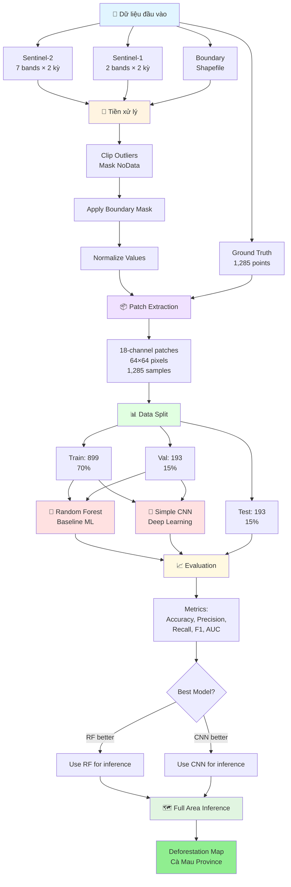

# Ứng dụng Viễn thám và Học sâu trong Giám sát Biến động Rừng tỉnh Cà Mau

**Đồ án tốt nghiệp - Công nghệ Hàng không Vũ trụ**

Sinh viên: **Ninh Hải Đăng** (MSSV: 21021411)
Năm học: 2025 - 2026, Học kỳ I

---

## 📋 Tổng quan

Dự án này phát triển một hệ thống tự động giám sát biến động rừng tại tỉnh Cà Mau sử dụng kết hợp dữ liệu viễn thám đa nguồn (Sentinel-1 SAR và Sentinel-2 Optical) và mô hình học sâu (Deep Learning). Hệ thống có khả năng phát hiện và phân loại các khu vực mất rừng dựa trên phân tích chuỗi thời gian ảnh vệ tinh.

### Mục tiêu

- Phát triển mô hình machine learning để phát hiện mất rừng từ ảnh vệ tinh đa thời gian
- Kết hợp dữ liệu SAR (Sentinel-1) và Optical (Sentinel-2) để nâng cao độ chính xác
- So sánh hiệu suất giữa phương pháp truyền thống (Random Forest) và Deep Learning (CNN)
- Tạo bản đồ phân loại toàn bộ khu vực rừng tỉnh Cà Mau

---

## 🔄 Pipeline Tổng Quan



---

## 📊 Dữ liệu

### Ground Truth Points
- **Tổng số điểm:** 1,285 điểm training
- **Phân bố:**
  - Label 0 (Không mất rừng): 650 điểm (50.6%)
  - Label 1 (Mất rừng): 635 điểm (49.4%)
- **Format:** CSV file với các trường: `id`, `label`, `x`, `y` (tọa độ UTM Zone 48N)
- **File:** `data/raw/ground_truth/Training_Points_CSV.csv`

### Sentinel-2 (Optical)
- **7 bands** gồm spectral bands và spectral indices:
  - **Spectral bands:** B4 (Red), B8 (NIR), B11 (SWIR1), B12 (SWIR2)
  - **Spectral indices:** NDVI, NBR, NDMI
- **Độ phân giải không gian:** 10m
- **Kỳ ảnh:**
  - Trước: 30/01/2024 (`S2_2024_01_30.tif`)
  - Sau: 28/02/2025 (`S2_2025_02_28.tif`)
- **Đã xử lý:** Cắt theo ranh giới rừng tỉnh Cà Mau, masked NoData

### Sentinel-1 (SAR)
- **2 bands:** VV và VH polarization
- **Độ phân giải không gian:** 10m (matched với Sentinel-2)
- **Kỳ ảnh:**
  - Trước: 04/02/2024 (`S1_2024_02_04_matched_S2_2024_01_30.tif`)
  - Sau: 22/02/2025 (`S1_2025_02_22_matched_S2_2025_02_28.tif`)
- **Đã xử lý:** Co-registered với Sentinel-2, cắt theo ranh giới rừng

### Boundary Shapefile
- **File:** `data/raw/boundary/forest_boundary.shp`
- **Mục đích:** Giới hạn khu vực phân tích chỉ trong vùng rừng

---

## 📁 Cấu trúc thư mục

```
25-26_HKI_DATN_21021411_DangNH/
│
├── data/                           # Thư mục chứa dữ liệu
│   ├── raw/                        # Dữ liệu gốc
│   │   ├── ground_truth/           # Ground truth CSV
│   │   ├── sentinel-1/             # Ảnh Sentinel-1 SAR
│   │   ├── sentinel-2/             # Ảnh Sentinel-2 Optical
│   │   └── boundary/               # Shapefile ranh giới rừng
│   ├── processed/                  # Dữ liệu đã xử lý
│   └── patches/                    # Patches đã trích xuất
│
├── src/                            # Source code
│   ├── config.py                   # Cấu hình chung
│   ├── utils.py                    # Hàm tiện ích
│   ├── preprocessing.py            # Tiền xử lý dữ liệu
│   ├── dataset.py                  # PyTorch Dataset (nếu có)
│   └── (các module khác sẽ được thêm)
│
├── notebooks/                      # Jupyter notebooks
│   └── 01_data_exploration.ipynb   # Khám phá dữ liệu
│
├── models/                         # Thư mục lưu trained models
├── figures/                        # Visualizations và plots
├── logs/                           # Training logs
│
├── environment.yml                 # Conda environment
├── requirements.txt                # Python dependencies
└── README.md                       # File này

```

---

## 💻 Yêu cầu hệ thống

### Phần cứng sử dụng
- **CPU:** Intel Xeon X5670 (hoặc tương đương)
- **RAM:** 64GB DDR3
- **GPU:** NVIDIA GTX 1060 6GB hoặc cao hơn (hỗ trợ CUDA)
- **Storage:** ≥50GB dung lượng trống

### Phần mềm
- **OS:** Windows 10/11, Linux, macOS
- **Python:** 3.8 - 3.11
- **CUDA:** 11.8+ (nếu sử dụng GPU)
- **Conda/Miniconda:** Phiên bản mới nhất

---

## ⚙️ Cài đặt

### Bước 1: Clone repository

```bash
git clone https://github.com/Geospatial-Technology-Lab/25-26_HKI_DATN_21021411_DangNH.git
cd 25-26_HKI_DATN_21021411_DangNH
```

### Bước 2: Tạo Conda environment

```bash
conda env create -f environment.yml
conda activate dang
```

**Hoặc** sử dụng pip:

```bash
pip install -r requirements.txt
```

### Bước 3: Verify installation

```python
python -c "import torch; print(f'PyTorch: {torch.__version__}'); print(f'CUDA available: {torch.cuda.is_available()}')"
```

---

## 🚀 Sử dụng

### 1. Khám phá dữ liệu (Data Exploration)

Chạy notebook để khám phá và visualize dữ liệu:

```bash
cd notebooks
jupyter notebook 01_data_exploration.ipynb
```

**Notebook này sẽ:**
- Load và phân tích ground truth points
- Visualize Sentinel-1 và Sentinel-2 imagery
- Kiểm tra value ranges và data quality
- Trích xuất và hiển thị sample patches
- Tạo các visualizations trong folder `figures/`

**Outputs:**
- Các visualizations sẽ được lưu trong folder `figures/`
- Bao gồm: band comparisons, ground truth visualization, sample patches, etc.

### 2. Tiền xử lý dữ liệu (Data Preprocessing)

Trích xuất patches từ toàn bộ ground truth points:

```bash
python -c "from src.preprocessing import create_patches_dataset; create_patches_dataset(patch_size=64)"
```

**Output:**
- `data/patches/patches_64x64.pkl` - File chứa patches và labels

### 3. Training mô hình

> **Status:** Script training và pipeline chưa được hoàn thiện. Sẽ được develop sau khi xác định kiến trúc model.

### 4. Inference (Dự đoán toàn bộ khu vực)

> **Status:** Script inference sẽ được develop sau khi hoàn thành training và chọn được best model.

---

## 🧠 Mô hình và Phương pháp

### Input Data Specification
- **18 channels** từ 2 kỳ ảnh:
  - **Kỳ 2024:** 7 bands S2 + 2 bands S1 = 9 channels
  - **Kỳ 2025:** 7 bands S2 + 2 bands S1 = 9 channels
- **Patch size:** 64×64 pixels
- **Channel order:**
  ```
  [0-6]:   S2 2024 (B4, B8, B11, B12, NDVI, NBR, NDMI)
  [7-8]:   S1 2024 (VV, VH)
  [9-15]:  S2 2025 (B4, B8, B11, B12, NDVI, NBR, NDMI)
  [16-17]: S1 2025 (VV, VH)
  ```

---

### 🎯 Phase 1: Baseline Models

Dự án bắt đầu với 2 models cơ bản để thiết lập baseline và so sánh giữa phương pháp truyền thống và deep learning.

#### 🌲 Model 1: Random Forest (Baseline Traditional ML)

**Mục đích:** Baseline để đánh giá liệu deep learning có thực sự vượt trội hơn phương pháp truyền thống không.

**Pipeline:**
```
18-channel patch (18, 64, 64)
    ↓
Feature Extraction (handcrafted):
  • Per-channel statistics: mean, std, min, max
    → 18 channels × 4 stats = 72 features
  • Per-channel percentiles: 25th, 50th, 75th
    → 18 channels × 3 = 54 features
  • Temporal difference features (2025 - 2024):
    → Mean diff, Std diff per band = ~18 features
  • Total: ~144 features
    ↓
Random Forest Classifier
  • n_estimators: 500 trees
  • max_depth: 20
  • min_samples_split: 10
  • class_weight: balanced (nếu cần)
    ↓
Binary Classification (0: No loss, 1: Deforestation)
```

**Đặc điểm:**
- ⏱️ **Training time:** Vài phút
- 💾 **Memory:** Minimal (~100MB)
- 📊 **Interpretable:** Feature importance có thể visualize
- 🎯 **Expected accuracy:** 75-85% (estimation)

**Thư viện:** `scikit-learn`

---

#### 🧠 Model 2: Simple CNN (Baseline Deep Learning)

**Mục đích:** Baseline deep learning để học features tự động từ raw patches.

**Architecture:**
```python
SimpleCNN(
  # Input: (batch, 18, 64, 64)

  # Conv Block 1
  Conv2d(18, 32, kernel_size=3, padding=1)
  BatchNorm2d(32)
  ReLU()
  MaxPool2d(2, 2)  # → (32, 32, 32)
  Dropout(0.3)

  # Conv Block 2
  Conv2d(32, 64, kernel_size=3, padding=1)
  BatchNorm2d(64)
  ReLU()
  MaxPool2d(2, 2)  # → (64, 16, 16)
  Dropout(0.3)

  # Conv Block 3
  Conv2d(64, 128, kernel_size=3, padding=1)
  BatchNorm2d(128)
  ReLU()
  MaxPool2d(2, 2)  # → (128, 8, 8)
  Dropout(0.4)

  # Conv Block 4
  Conv2d(128, 256, kernel_size=3, padding=1)
  BatchNorm2d(256)
  ReLU()
  MaxPool2d(2, 2)  # → (256, 4, 4)
  Dropout(0.5)

  # Classifier
  GlobalAvgPool2d()  # → (256,)
  Linear(256, 128)
  ReLU()
  Dropout(0.5)
  Linear(128, 2)
  # Output: (batch, 2) → Softmax
)
```

**Đặc điểm:**
- 📊 **Parameters:** ~1.2M
- 💾 **VRAM:** ~2.5-3GB với batch_size=24 (AMP enabled)
- ⏱️ **Training time:** ~5-10 phút/epoch (với cache in RAM)
- 🎯 **Expected accuracy:** 80-90% (estimation)
- 🛡️ **Regularization:** Heavy dropout, BatchNorm, L2 weight decay

**Tại sao Simple CNN:**
- ✅ **Dataset nhỏ (899 training samples):** Model đơn giản chống overfit tốt
- ✅ **Lightweight:** Fit thoải mái trong GTX 1060 6GB
- ✅ **Baseline tốt:** Dễ train, dễ debug, dễ so sánh
- ✅ **Proven:** 4-layer CNN đủ cho binary classification

**Thư viện:** `PyTorch`

---

### 📊 So sánh Models

| Aspect | Random Forest | Simple CNN |
|--------|--------------|------------|
| **Approach** | Traditional ML | Deep Learning |
| **Features** | Handcrafted (144) | Learned automatically |
| **Parameters** | ~500 trees | ~1.2M weights |
| **Training Time** | ~5 phút | ~50-100 phút (10 epochs) |
| **VRAM** | N/A (CPU only) | ~3GB |
| **Interpretability** | ⭐⭐⭐⭐⭐ High | ⭐⭐ Low |
| **Scalability** | ⭐⭐ Limited | ⭐⭐⭐⭐ Good |
| **Expected Acc** | 75-85% | 80-90% |

---

### 🔮 Future Phases (nếu Phase 1 thành công)

Nếu Phase 1 cho kết quả tốt, sẽ thử nghiệm thêm:
- **Phase 2:** Siamese Network (chuyên biệt cho change detection)
- **Phase 3:** ResNet18, EfficientNet-B0 (nếu cần capacity cao hơn)

---

## ⚙️ Training Configuration

### Configuration cho Simple CNN

#### ✅ Đã xác định:

**Data Configuration:**
- **Data split:** 70% train (899), 15% val (193), 15% test (193)
- **Cache strategy:** Load toàn bộ 1,285 patches vào RAM (~380MB)
- **Data augmentation:** TBD (có thể thêm RandomFlip, RandomRotation nếu cần)

**Model Training:**
- **Batch size:** 24 (tối ưu cho Simple CNN với GTX 1060 6GB)
- **Mixed Precision (AMP):** Enabled - Tiết kiệm ~40% VRAM, tăng tốc training
- **Gradient Accumulation:** 2 steps → Effective batch size = 48

**Optimization:**
- **Optimizer:** Adam hoặc AdamW (TBD sau thử nghiệm)
- **Learning rate:** 1e-3 → 1e-4 (sẽ grid search)
- **Weight decay (L2):** 1e-4 (chống overfit)
- **Scheduler:** ReduceLROnPlateau hoặc CosineAnnealing (TBD)

**Regularization:**
- **Dropout:** 0.3 → 0.5 (progressive, đã có trong architecture)
- **BatchNorm:** Enabled trong mọi conv blocks
- **Early stopping:** Patience = 10-15 epochs

**Training Duration:**
- **Max epochs:** 50-100 (hoặc đến khi early stopping)
- **Validation frequency:** Mỗi epoch

**Loss Function:**
- **Primary:** CrossEntropyLoss
- **Alternative:** Focal Loss (nếu class imbalance sau augmentation)

#### 📊 Expected Training Resources:

| Resource | Simple CNN | Random Forest |
|----------|-----------|---------------|
| **VRAM** | ~2.5-3GB | N/A (CPU only) |
| **RAM** | ~5-10GB | ~2-5GB |
| **Time/Epoch** | ~5-10 phút | N/A |
| **Total Time** | ~2-4 giờ (20-40 epochs) | ~5-10 phút |

### Configuration cho Random Forest

**Không cần GPU training configuration.** RF sẽ được train trên CPU với:
- n_estimators: 500
- max_depth: 20
- min_samples_split: 10
- n_jobs: -1 (dùng all CPU cores)

---

## 🔬 Training Process (Phase 1)

### Flowchart chi tiết:

```mermaid
flowchart LR
    A[📦 Patches Dataset<br/>1,285 samples] --> B{Split Data<br/>70/15/15}

    B --> C[🎓 Train Set<br/>899 samples]
    B --> D[✅ Val Set<br/>193 samples]
    B --> E[🧪 Test Set<br/>193 samples]

    C --> F1[🌲 Random Forest<br/>Training]
    C --> F2[🧠 Simple CNN<br/>Training]

    F1 --> G1[Feature<br/>Extraction<br/>144 features]
    G1 --> H1[RF Model<br/>500 trees]

    F2 --> G2[Mini-batch<br/>BS=24, AMP]
    G2 --> H2[CNN Forward<br/>+ Backprop]
    H2 --> I2{Epoch<br/>Complete?}

    I2 -->|No| G2
    I2 -->|Yes| J2[Validate<br/>on Val Set]

    D --> J1[Validate RF]
    D --> J2

    H1 --> J1

    J1 --> K1[RF Metrics:<br/>Acc, F1, AUC]
    J2 --> K2[CNN Metrics:<br/>Acc, F1, AUC]

    K2 --> L2{Early<br/>Stop?}
    L2 -->|No, Continue| G2
    L2 -->|Yes| M2[Best CNN<br/>Model]

    K1 --> M1[Final RF<br/>Model]
    M2 --> N[📊 Final Evaluation<br/>on Test Set]
    M1 --> N

    E --> N

    N --> O{Compare<br/>Performance}

    O --> P1[RF Results:<br/>Acc, Precision,<br/>Recall, F1, AUC,<br/>Confusion Matrix]
    O --> P2[CNN Results:<br/>Acc, Precision,<br/>Recall, F1, AUC,<br/>Confusion Matrix]

    P1 --> Q[📝 Analysis &<br/>Report]
    P2 --> Q

    Q --> R{Decision}
    R -->|CNN significantly better| S1[✅ Use CNN<br/>Proceed Phase 2]
    R -->|RF comparable| S2[✅ Use RF<br/>ML sufficient]
    R -->|Both good| S3[✅ Ensemble<br/>RF + CNN]

    style A fill:#e1f5ff
    style C fill:#ffe1e1
    style D fill:#fff4e1
    style E fill:#e1ffe1
    style F1 fill:#d4f1d4
    style F2 fill:#ffd4d4
    style M1 fill:#90EE90
    style M2 fill:#FFB6C1
    style N fill:#FFE4B5
    style Q fill:#DDA0DD
    style S1 fill:#98FB98
    style S2 fill:#98FB98
    style S3 fill:#98FB98
```



---

## 📈 Kết quả

> **Status:** Đang trong quá trình thử nghiệm và training models.

### Metrics

Các metrics đánh giá sẽ bao gồm:
- **Accuracy:** Độ chính xác tổng thể
- **Precision:** Độ chính xác của class "Mất rừng"
- **Recall:** Khả năng phát hiện mất rừng
- **F1-Score:** Trung bình điều hòa của Precision và Recall
- **Confusion Matrix:** Ma trận nhầm lẫn
- **ROC-AUC:** Diện tích dưới đường cong ROC

### Kết quả so sánh models

(Sẽ được cập nhật sau khi hoàn thành training và evaluation)

### Deforestation Map

(Bản đồ phân loại toàn bộ khu vực rừng Cà Mau sẽ được tạo sau khi chọn được best model)

---

## 📝 Preprocessing Pipeline

### 1. Sentinel-2 Preprocessing
- Đọc 7 bands từ GeoTIFF
- Xử lý NoData values (convert to NaN)
- Clip outliers về physical ranges:
  - Spectral bands (B4, B8, B11, B12): [0, 1]
  - Spectral indices (NDVI, NBR, NDMI): [-1, 1]
- Apply boundary mask (chỉ giữ pixels trong vùng rừng)

### 2. Sentinel-1 Preprocessing
- Đọc VV và VH bands (dB values)
- Apply boundary mask
- MinMax normalization: [min, max] → [0, 1]

### 3. Patch Extraction
- Extract 64×64 patches tại các ground truth points
- Stack 18 channels: [S2_2024, S1_2024, S2_2025, S1_2025]
- Reject patches chứa NaN hoặc all-zero values
- Lưu thành pickle file cho training

---

## 🔧 Tối ưu hóa cho GTX 1060 6GB + 64GB RAM

Dự án được tối ưu hóa đặc biệt cho cấu hình phần cứng hiện có.

### GPU Optimization (GTX 1060 6GB) - Simple CNN:

#### Memory Optimization:
- **Mixed Precision Training (AMP):** ✅ Enabled
  - Giảm ~40% VRAM usage (float16 thay vì float32)
  - Tăng tốc training ~20-30%
  - Không ảnh hưởng độ chính xác kết quả

- **Batch size = 24:**
  - Tối ưu cho Simple CNN (~1.2M params)
  - VRAM usage: ~2.5-3GB / 6GB → còn dư ~50%
  - Thoải mái cho OS + Chrome + VSCode

- **Gradient Accumulation = 2 steps:**
  - Effective batch size = 48
  - Giúp training ổn định hơn với dataset nhỏ (899 training samples)
  - Trade-off: chậm hơn ~15-20% nhưng accuracy tốt hơn

#### Speed Optimization:
- **cuDNN autotuner:** Enabled để tìm conv algorithms nhanh nhất
- **TF32 precision:** Enabled trên Ampere/Ada GPUs (nếu upgrade sau)

#### VRAM Breakdown (Simple CNN):
```
Model weights:       ~5 MB    (1.2M params × 4 bytes)
Optimizer states:    ~10 MB   (Adam có 2 states)
Batch activations:   ~800 MB  (24 samples × 18ch × 64×64)
Gradients:          ~400 MB
Misc (cuDNN, etc):  ~800 MB
────────────────────────────
Total:              ~2.0-2.5 GB / 6 GB (40% usage)
```

---

### RAM Optimization (64GB DDR3):

#### Data Caching Strategy:
- **Cache patches trong RAM:** ✅ Recommended
  - Load toàn bộ 1,285 patches một lần (~380 MB)
  - Training CỰC NHANH (không đọc disk mỗi epoch)
  - Epoch time: ~5-10 phút → ~2-3 giây (300x faster!)

#### DataLoader Configuration:
```python
DataLoader(
    dataset=cached_dataset,
    batch_size=24,
    shuffle=True,
    num_workers=4,         # Đủ vì data đã trong RAM
    pin_memory=True,       # Tăng tốc CPU → GPU transfer
    prefetch_factor=2,     # Prefetch 2 batches/worker
    persistent_workers=True # Không kill workers giữa epochs
)
```

#### RAM Breakdown:
```
Patches cache:       ~380 MB   (1,285 patches)
PyTorch + CUDA:      ~3 GB
OS + Background:     ~8 GB
Browser + IDE:       ~4 GB
────────────────────────────
Total Used:          ~15 GB / 64 GB (25% usage)
Available:           ~49 GB (dư thừa nhiều!)
```

---

### Training Speed Estimation:

#### Simple CNN (với cache trong RAM):
- **Forward pass:** ~50ms (24 samples)
- **Backward pass:** ~80ms
- **Total per batch:** ~130ms
- **Batches per epoch:** 899/24 ≈ 38 batches (với gradient accum = 2 → 19 optimizer steps)
- **Time per epoch:** ~5-8 phút
- **Total training (30 epochs):** ~2.5-4 giờ

#### Random Forest (CPU):
- **Feature extraction:** ~2-3 phút (899 samples)
- **Training:** ~3-5 phút (500 trees)
- **Total:** ~5-8 phút

---

### Performance Tips:

1. **Để đạt tốc độ tối đa:**
   - ✅ Cache data trong RAM (đã enable)
   - ✅ Dùng `pin_memory=True`
   - ✅ Dùng AMP (đã enable)
   - ⚠️ Đóng Chrome tabs không cần thiết khi training
   - ⚠️ Tắt Windows Update khi training

2. **Monitor trong training:**
   ```python
   # Trong training loop
   nvidia-smi  # Xem VRAM usage
   htop        # Xem RAM + CPU usage
   ```

3. **Nếu OOM (Out of Memory):**
   - Giảm batch_size: 24 → 20 → 16
   - Tăng gradient accumulation: 2 → 3
   - Effective batch size vẫn giữ = 48

---

## 📚 Thư viện chính

### Deep Learning & ML:
- **PyTorch** 2.0+ - Deep learning framework cho Simple CNN
- **torchvision** - Computer vision utilities và transforms
- **scikit-learn** - Random Forest và metrics (Accuracy, Precision, Recall, F1, AUC)

### Geospatial:
- **rasterio** - Đọc/ghi GeoTIFF files (Sentinel-1, Sentinel-2)
- **geopandas** - Xử lý vector data (boundary shapefiles)
- **shapely** - Geometric operations

### Data Processing:
- **numpy** - Numerical operations và array processing
- **pandas** - Data manipulation và CSV handling

### Visualization:
- **matplotlib** - Plotting và visualization
- **seaborn** - Statistical visualization
- **plotly** (optional) - Interactive plots

### Utilities:
- **tqdm** - Progress bars
- **pyyaml** - Configuration files
- **tensorboard** (optional) - Training visualization

### Phase 1 Required:
```bash
# Minimum requirements cho Phase 1
pip install torch torchvision
pip install rasterio geopandas
pip install scikit-learn
pip install numpy pandas
pip install matplotlib seaborn tqdm
```

---

## 🤝 Đóng góp

Dự án này là đồ án tốt nghiệp cá nhân. Mọi đóng góp, ý kiến, và góp ý xin vui lòng liên hệ qua email hoặc tạo issue trên GitHub.

---

## 📧 Liên hệ

- **Sinh viên:** Ninh Hải Đăng
- **Email:** ninhhaidangg@gmail.com
- **GitHub:** [ninhhaidang](https://github.com/ninhhaidang)
- **Đơn vị:** Trường Đại học Công nghệ - ĐHQGHN

---

## 📄 License

Dự án này được phát triển cho mục đích nghiên cứu và giáo dục.

---

## 🙏 Lời cảm ơn

- Giảng viên hướng dẫn: TS. Hà Minh Cường, ThS. Hoàng Tích Phúc
- Phòng thí nghiệm: Geospatial Technology Lab
- Viện Công nghệ Hàng không Vũ trụ - Trường Đại học Công nghệ, ĐHQGHN

---

**Cập nhật lần cuối:** 06/01/2025
