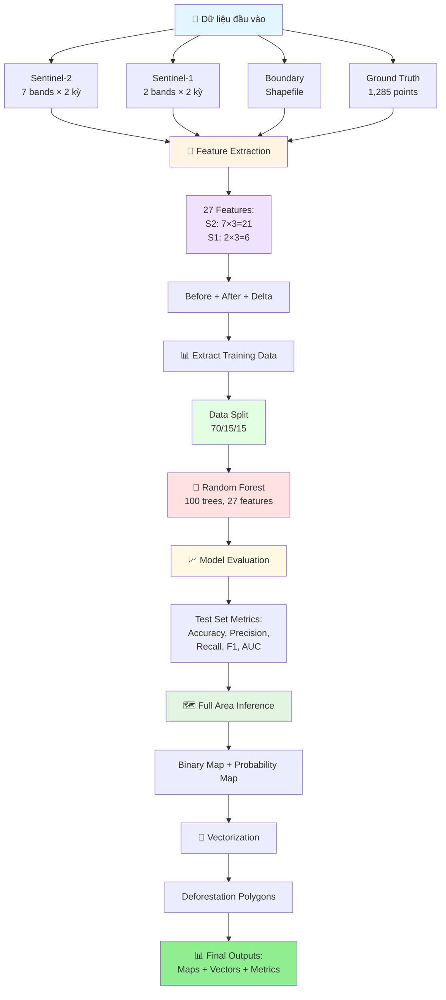
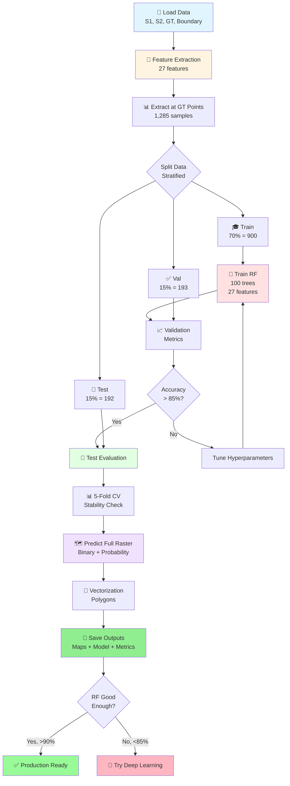

# Ứng dụng Viễn thám và Học sâu trong Giám sát Biến động Rừng tỉnh Cà Mau

**Đồ án tốt nghiệp - Công nghệ Hàng không Vũ trụ**

Sinh viên: **Ninh Hải Đăng** (MSSV: 21021411)
Năm học: 2025 - 2026, Học kỳ I

---

## 📋 Tổng quan

Dự án này phát triển một hệ thống tự động giám sát biến động rừng tại tỉnh Cà Mau sử dụng kết hợp dữ liệu viễn thám đa nguồn (Sentinel-1 SAR và Sentinel-2 Optical) và mô hình học sâu (Deep Learning). Hệ thống có khả năng phát hiện và phân loại các khu vực mất rừng dựa trên phân tích chuỗi thời gian ảnh vệ tinh.

### Mục tiêu

- Phát triển mô hình machine learning để phát hiện mất rừng từ ảnh vệ tinh đa thời gian
- Kết hợp dữ liệu SAR (Sentinel-1) và Optical (Sentinel-2) để nâng cao độ chính xác
- Xây dựng baseline với Random Forest, sau đó mở rộng sang Deep Learning
- Tạo bản đồ phân loại toàn bộ khu vực rừng tỉnh Cà Mau

---

## 🔄 Pipeline Tổng Quan



---

## 📊 Dữ liệu

### Ground Truth Points
- **Tổng số điểm:** 1,285 điểm training
- **Phân bố:**
  - Label 0 (Không mất rừng): 650 điểm (50.6%)
  - Label 1 (Mất rừng): 635 điểm (49.4%)
- **Format:** CSV file với các trường: `id`, `label`, `x`, `y` (tọa độ UTM Zone 48N)
- **File:** `data/raw/ground_truth/Training_Points_CSV.csv`

### Sentinel-2 (Optical)
- **7 bands** gồm spectral bands và spectral indices:
  - **Spectral bands:** B4 (Red), B8 (NIR), B11 (SWIR1), B12 (SWIR2)
  - **Spectral indices:** NDVI, NBR, NDMI
- **Độ phân giải không gian:** 10m
- **Kỳ ảnh:**
  - Trước: 30/01/2024 (`S2_2024_01_30.tif`)
  - Sau: 28/02/2025 (`S2_2025_02_28.tif`)
- **Đã xử lý:** Cắt theo ranh giới rừng tỉnh Cà Mau, masked NoData

### Sentinel-1 (SAR)
- **2 bands:** VV và VH polarization
- **Độ phân giải không gian:** 10m (matched với Sentinel-2)
- **Kỳ ảnh:**
  - Trước: 04/02/2024 (`S1_2024_02_04_matched_S2_2024_01_30.tif`)
  - Sau: 22/02/2025 (`S1_2025_02_22_matched_S2_2025_02_28.tif`)
- **Đã xử lý:** Co-registered với Sentinel-2, cắt theo ranh giới rừng

### Boundary Shapefile
- **File:** `data/raw/boundary/forest_boundary.shp`
- **Mục đích:** Giới hạn khu vực phân tích chỉ trong vùng rừng

---

## 📁 Cấu trúc thư mục

```
25-26_HKI_DATN_21021411_DangNH/
│
├── data/                           # Thư mục chứa dữ liệu
│   ├── raw/                        # Dữ liệu gốc
│   │   ├── ground_truth/           # Ground truth CSV
│   │   ├── sentinel-1/             # Ảnh Sentinel-1 SAR
│   │   ├── sentinel-2/             # Ảnh Sentinel-2 Optical
│   │   └── boundary/               # Shapefile ranh giới rừng
│   ├── processed/                  # Dữ liệu đã xử lý
│   └── patches/                    # Patches đã trích xuất
│
├── src/                            # Source code
│   ├── common/                     # Shared modules
│   │   ├── config.py               # Configuration
│   │   ├── data_loader.py          # Data loading
│   │   ├── feature_extraction.py   # Feature extraction (27 features)
│   │   ├── evaluation.py           # Model evaluation
│   │   ├── visualization.py        # Plotting
│   │   └── utils.py                # Utilities
│   │
│   ├── random_forest/              # Random Forest model
│   │   ├── train.py                # Training
│   │   ├── predict.py              # Prediction
│   │   └── vectorization.py        # Vectorization
│   │
│   ├── _deprecated/                # Old files (backup)
│   ├── main.py                     # Pipeline entry point
│   └── README.md                   # Source code documentation
│
├── notebook/                       # Jupyter notebooks
│   └── random_forest.ipynb         # Random Forest pipeline notebook
│
├── results/                        # Kết quả outputs
│   ├── rasters/                    # Classification maps
│   ├── vectors/                    # Deforestation polygons
│   ├── models/                     # Trained models
│   ├── data/                       # Metrics và features
│   └── plots/                      # Visualizations
│
├── environment.yml                 # Conda environment
├── requirements.txt                # Python dependencies
└── README.md                       # File này

```

---

## 💻 Yêu cầu hệ thống

### Phần cứng sử dụng
- **CPU:** Intel Xeon X5670 (hoặc tương đương)
- **RAM:** 64GB DDR3
- **GPU:** NVIDIA GTX 1060 6GB hoặc cao hơn (hỗ trợ CUDA)
- **Storage:** ≥50GB dung lượng trống

### Phần mềm
- **OS:** Windows 10/11, Linux, macOS
- **Python:** 3.8 - 3.11
- **CUDA:** 11.8+ (nếu sử dụng GPU)
- **Conda/Miniconda:** Phiên bản mới nhất

---

## ⚙️ Cài đặt

### Bước 1: Clone repository

```bash
git clone https://github.com/Geospatial-Technology-Lab/25-26_HKI_DATN_21021411_DangNH.git
cd 25-26_HKI_DATN_21021411_DangNH
```

### Bước 2: Tạo Conda environment

```bash
conda env create -f environment.yml
conda activate dang
```

**Hoặc** sử dụng pip:

```bash
pip install -r requirements.txt
```

### Bước 3: Verify installation

```python
python -c "import torch; print(f'PyTorch: {torch.__version__}'); print(f'CUDA available: {torch.cuda.is_available()}')"
```

---

## 🚀 Sử dụng

### Option 1: Chạy toàn bộ Pipeline (Khuyến nghị)

**Chạy qua Python script:**
```bash
cd src
python main.py
```

**Hoặc chạy qua Jupyter Notebook:**
```bash
jupyter lab
# Mở file: notebooks/random_forest.ipynb
# Chạy tất cả cells từ trên xuống
```

**Pipeline sẽ thực hiện các bước:**
1. ⚙️ Setup & Load Data (~2-5 phút)
2. 🔧 Feature Extraction (~1-2 phút) - 27 features
3. 📊 Extract Training Data (~30 giây)
4. 🌲 Train Random Forest (~3-5 phút)
5. 📈 Model Evaluation (~2-3 phút)
6. 🗺️ Predict Full Raster (~5-10 phút)
7. 📐 Vectorization (~2-5 phút, optional)
8. 📊 Visualization (~1-2 phút)
9. ✅ Summary & Results

**Tổng thời gian:** ~15-30 phút

---

### Option 2: Import modules trực tiếp

Bạn có thể import và sử dụng các modules riêng lẻ:

```python
# Import common modules
from common.data_loader import DataLoader
from common.feature_extraction import FeatureExtraction
from common.evaluation import ModelEvaluator
from common.visualization import Visualizer

# Import Random Forest modules
from random_forest.train import RandomForestTrainer, TrainingDataExtractor
from random_forest.predict import RasterPredictor
from random_forest.vectorization import Vectorizer

# Use them
loader = DataLoader()
s2_before, s2_after = loader.load_sentinel2()

extractor = FeatureExtraction()
features, mask = extractor.extract_features(s2_before, s2_after, s1_before, s1_after)
```

> **Note:** Old step-by-step files (`step*.py`) đã được chuyển vào `src/_deprecated/` folder.

---

### Skip Vectorization (Nhanh hơn)

Nếu không cần vector polygons, skip bước 8:

```bash
python main.py --skip-vectorization
```

Hoặc trong notebook:
```python
RUN_VECTORIZATION = False
```

---

### Output Files

Sau khi chạy xong, kiểm tra folder `results/`:

```
results/
├── rasters/
│   ├── rf_classification.tif               # Binary classification map
│   └── rf_probability.tif                  # Probability map
├── vectors/
│   └── rf_deforestation_polygons.geojson   # Deforestation polygons (nếu có)
├── models/
│   └── rf_model.pkl                        # Trained Random Forest model
├── data/
│   ├── rf_training_data.csv                # Training features
│   ├── rf_feature_importance.csv           # Feature importance rankings
│   └── rf_evaluation_metrics.json          # Evaluation metrics
└── plots/
    ├── rf_confusion_matrices.png           # Confusion matrices
    ├── rf_roc_curve.png                    # ROC curve
    ├── rf_feature_importance.png           # Feature importance plot
    ├── rf_classification_maps.png          # Classification maps
    └── rf_cv_scores.png                    # Cross-validation scores
```

---

## 🧠 Mô hình và Phương pháp

### Feature Extraction - 27 Features

Thay vì sử dụng patches, dự án hiện tại trích xuất **27 features pixel-wise** từ dữ liệu viễn thám:

**Cấu trúc features:**
```
Sentinel-2 (21 features):
├── Before (7):  B4, B8, B11, B12, NDVI, NBR, NDMI
├── After (7):   B4, B8, B11, B12, NDVI, NBR, NDMI
└── Delta (7):   ΔB4, ΔB8, ΔB11, ΔB12, ΔNDVI, ΔNBR, ΔNDMI

Sentinel-1 (6 features):
├── Before (2):  VV, VH
├── After (2):   VV, VH
└── Delta (2):   ΔVV, ΔVH

TỔNG: 27 features
```

**Lợi ích của cách tiếp cận này:**
- ✅ Khai thác thông tin temporal (delta features)
- ✅ Đơn giản, dễ train và interpret
- ✅ Không cần GPU cho Random Forest
- ✅ Feature importance giúp hiểu model behavior

---

## 🌲 Random Forest Approach (Current)

### Pipeline 9 Bước

**Quy trình xử lý:**

1. **Setup & Configuration** - Cấu hình paths và parameters
2. **Load Data** - Load Sentinel-1, Sentinel-2, Ground Truth, Boundary
3. **Feature Extraction** - Tạo 27 features (before + after + delta)
4. **Extract Training Data** - Trích xuất features tại ground truth points
5. **Train Random Forest** - Train model với 100 trees
6. **Model Evaluation** - Đánh giá trên validation và test sets
7. **Predict Full Raster** - Dự đoán trên toàn bộ khu vực
8. **Vectorization** - Convert raster sang polygons (optional)
9. **Visualization** - Tạo plots và save outputs

**Cấu hình Random Forest:**
```python
{
    'n_estimators': 100,          # 100 decision trees
    'max_features': 'sqrt',       # √27 ≈ 5 features per split
    'max_depth': None,            # Unlimited depth
    'class_weight': 'balanced',   # Handle class imbalance
    'oob_score': True,            # Out-of-bag evaluation
    'random_state': 42            # Reproducibility
}
```

**Đặc điểm:**
- ⏱️ **Training time:** ~5-10 phút
- 💾 **Memory:** ~2-5GB RAM
- 📊 **Interpretable:** Feature importance rankings
- 🎯 **Target accuracy:** > 85%
- 💻 **Hardware:** CPU-only (không cần GPU)

**Output Files:**
- `rf_classification.tif` - Binary classification map (0/1)
- `rf_probability.tif` - Probability map (0.0-1.0)
- `rf_deforestation_polygons.geojson` - Vector polygons
- `rf_model.pkl` - Trained Random Forest model
- `rf_feature_importance.csv` - Feature importance rankings
- `rf_evaluation_metrics.json` - Performance metrics

**Thư viện:** `scikit-learn`, `rasterio`, `geopandas`

---

## 🔮 Deep Learning Approach (Future Work)

Sau khi hoàn thành và đánh giá Random Forest baseline, dự án sẽ mở rộng sang Deep Learning để so sánh performance.

### Kế hoạch Deep Learning

**Phase 2: CNN-based Approaches**

Các kiến trúc đang cân nhắc:

1. **Simple CNN** - Baseline deep learning
   - 3-4 conv layers
   - Input: Multi-temporal patches
   - Target: Binary classification
   - Parameters: ~1-2M
   - Training time: 1-2 giờ trên GTX 1060

2. **U-Net** - Semantic segmentation
   - Encoder-decoder architecture
   - Pixel-wise predictions
   - Better spatial context
   - Parameters: ~5-10M

3. **Siamese Network** - Change detection specialist
   - Twin networks cho before/after
   - Distance learning
   - Specialized for temporal analysis

**Lý do chưa implement:**
- ✅ Cần baseline solid với Random Forest trước
- ✅ Đánh giá xem deep learning có cần thiết không
- ✅ Nếu RF đạt >90% accuracy, có thể không cần CNN
- ✅ Dataset nhỏ (1,285 samples) → risk of overfitting với deep learning

**Next Steps:**
1. Hoàn thành Random Forest evaluation
2. Analyze feature importance
3. Nếu RF accuracy < 85%, implement CNN
4. So sánh RF vs CNN performance
5. Chọn best model cho production

---

## ⚙️ Training Configuration

### Random Forest Configuration

**Model Parameters:**
```python
RF_PARAMS = {
    'n_estimators': 100,           # Số lượng decision trees
    'max_features': 'sqrt',        # Features per split: √27 ≈ 5
    'max_depth': None,             # Không giới hạn độ sâu
    'min_samples_split': 2,        # Min samples để split node
    'min_samples_leaf': 1,         # Min samples ở leaf node
    'bootstrap': True,             # Bootstrap sampling
    'oob_score': True,             # Out-of-bag score
    'class_weight': 'balanced',    # Xử lý class imbalance
    'n_jobs': -1,                  # Dùng tất cả CPU cores
    'random_state': 42             # Reproducibility
}
```

**Data Split Configuration:**
```python
TRAIN_TEST_SPLIT = {
    'train_size': 0.70,      # 70% training (~900 samples)
    'val_size': 0.15,        # 15% validation (~193 samples)
    'test_size': 0.15,       # 15% test (~192 samples)
    'stratify': True,        # Giữ class distribution
    'random_state': 42       # Reproducibility
}
```

**Cross-Validation:**
- **Method:** Stratified K-Fold
- **K:** 5 folds
- **Metrics:** Accuracy, Precision, Recall, F1-Score, AUC

**Hardware Requirements:**
- **CPU:** Multi-core (sử dụng n_jobs=-1)
- **RAM:** ~2-5GB
- **GPU:** Không cần
- **Training time:** ~5-10 phút (toàn bộ pipeline ~15-30 phút)

---

## 🔬 Training Process

### Random Forest Workflow:



---

## 📈 Kết quả

### Evaluation Metrics

Mô hình Random Forest được đánh giá qua các metrics sau:

**Classification Metrics:**
- **Accuracy:** Độ chính xác tổng thể (target: >85%)
- **Precision:** Độ chính xác của class "Mất rừng"
- **Recall:** Khả năng phát hiện mất rừng
- **F1-Score:** Trung bình điều hòa của Precision và Recall
- **ROC-AUC:** Diện tích dưới đường cong ROC

**Robustness Check:**
- **5-Fold Cross Validation:** Đánh giá độ ổn định
- **Out-of-Bag Score:** OOB evaluation (RF built-in)
- **Confusion Matrix:** Phân tích chi tiết lỗi phân loại

**Feature Analysis:**
- **Feature Importance Rankings:** Top 20 features quan trọng nhất
- **Temporal vs Spectral:** So sánh delta features vs before/after

### Output Products

**1. Deforestation Maps:**
- Binary classification map (0 = No loss, 1 = Deforestation)
- Probability map (0.0 - 1.0, confidence scores)
- GeoTIFF format với đầy đủ metadata

**2. Vector Data:**
- Deforestation polygons (GeoJSON)
- Area statistics (m² và hectares)
- Ready để integrate vào GIS

**3. Model Artifacts:**
- Trained Random Forest model (.pkl)
- Feature importance rankings
- Evaluation metrics (JSON + CSV)

> **Status:** Kết quả chi tiết sẽ được cập nhật sau khi hoàn thành training và evaluation pipeline

---

## 📝 Preprocessing Pipeline

### 1. Sentinel-2 Preprocessing
- Đọc 7 bands từ GeoTIFF
- Xử lý NoData values (convert to NaN)
- Clip outliers về physical ranges:
  - Spectral bands (B4, B8, B11, B12): [0, 1]
  - Spectral indices (NDVI, NBR, NDMI): [-1, 1]
- Apply boundary mask (chỉ giữ pixels trong vùng rừng)

### 2. Sentinel-1 Preprocessing
- Đọc VV và VH bands (dB values)
- Apply boundary mask
- MinMax normalization: [min, max] → [0, 1]

### 3. Patch Extraction
- Extract 64×64 patches tại các ground truth points
- Stack 18 channels: [S2_2024, S1_2024, S2_2025, S1_2025]
- Reject patches chứa NaN hoặc all-zero values
- Lưu thành pickle file cho training

---

## 🔧 Tối ưu hóa cho Phần cứng

Dự án Random Forest được tối ưu hóa cho cấu hình phần cứng hiện có.

### CPU Optimization (Random Forest):

**Multi-threading:**
- **n_jobs = -1:** Sử dụng tất cả CPU cores
- **Parallel tree building:** Mỗi tree được train độc lập
- **Expected speedup:** Linear với số cores (4-8 cores → 4-8x faster)

**Training Speed:**
- **Feature extraction:** ~1-2 phút (tại 1,285 ground truth points)
- **RF training:** ~3-5 phút (100 trees)
- **Full raster prediction:** ~5-10 phút (batch processing)
- **Total pipeline:** ~15-30 phút (với vectorization)

---

### RAM Optimization (64GB DDR3):

**Memory Usage:**
```
Sentinel-2 data:     ~7.6 GB  (7 bands × 2 kỳ)
Sentinel-1 data:     ~2.2 GB  (2 bands × 2 kỳ)
Feature stack:       ~3.5 GB  (27 features)
RF model:            ~100 MB  (100 trees)
Working memory:      ~2 GB
OS + Background:     ~8 GB
────────────────────────────
Total Used:          ~23 GB / 64 GB (36% usage)
Available:           ~41 GB (dư thừa)
```

**Optimization Tips:**
- ✅ Load data once và reuse
- ✅ Use batch processing cho full raster prediction
- ✅ Đóng ứng dụng không cần thiết khi chạy pipeline
- ✅ Monitor RAM usage với Task Manager

---

### Performance Tips:

**1. Tăng tốc độ training:**
```python
# Sử dụng all CPU cores
RF_PARAMS = {
    'n_jobs': -1,  # -1 = use all cores
    ...
}
```

**2. Giảm memory usage (nếu cần):**
```python
# Giảm batch_size trong full raster prediction
predictor.predict_raster(..., batch_size=5000)  # Thay vì 10000
```

**3. Skip vectorization (nếu không cần):**
```python
# Trong main.py hoặc notebook
RUN_VECTORIZATION = False  # Tiết kiệm ~2-5 phút
```

**4. Monitor performance:**
```bash
# Windows Task Manager: Ctrl+Shift+Esc
# Xem CPU usage, RAM usage trong tab Performance
```

---

## 📚 Thư viện chính

### Machine Learning:
- **scikit-learn** - Random Forest và metrics (Accuracy, Precision, Recall, F1, AUC)
- **scipy** - Scientific computing và morphological operations

### Geospatial:
- **rasterio** - Đọc/ghi GeoTIFF files (Sentinel-1, Sentinel-2)
- **geopandas** - Xử lý vector data (boundary shapefiles)
- **shapely** - Geometric operations

### Data Processing:
- **numpy** - Numerical operations và array processing
- **pandas** - Data manipulation và CSV handling

### Visualization:
- **matplotlib** - Plotting và visualization
- **seaborn** - Statistical visualization
- **plotly** (optional) - Interactive plots

### Utilities:
- **tqdm** - Progress bars
- **pyyaml** - Configuration files

### Current Requirements:
```bash
# Cài đặt packages cho Random Forest approach
pip install scikit-learn scipy
pip install rasterio geopandas shapely
pip install numpy pandas
pip install matplotlib seaborn tqdm
```

### Future Deep Learning Requirements:
```bash
# Sẽ cần khi implement CNN/U-Net (Phase 2)
pip install torch torchvision
pip install tensorboard  # Training visualization
```

---

## 🤝 Đóng góp

Dự án này là đồ án tốt nghiệp cá nhân. Mọi đóng góp, ý kiến, và góp ý xin vui lòng liên hệ qua email hoặc tạo issue trên GitHub.

---

## 📧 Liên hệ

- **Sinh viên:** Ninh Hải Đăng
- **Email:** ninhhaidangg@gmail.com
- **GitHub:** [ninhhaidang](https://github.com/ninhhaidang)
- **Đơn vị:** Trường Đại học Công nghệ - ĐHQGHN

---

## 📄 License

Dự án này được phát triển cho mục đích nghiên cứu và giáo dục.

---

## 🙏 Lời cảm ơn

- Giảng viên hướng dẫn: TS. Hà Minh Cường, ThS. Hoàng Tích Phúc
- Phòng thí nghiệm: Geospatial Technology Lab
- Viện Công nghệ Hàng không Vũ trụ - Trường Đại học Công nghệ, ĐHQGHN

---

---

## 📚 Tài liệu tham khảo

- [src/README.md](src/README.md) - Hướng dẫn chi tiết source code structure
- [notebook/random_forest.ipynb](notebook/random_forest.ipynb) - Interactive notebook cho Random Forest pipeline

---

**Cập nhật lần cuối:** 07/01/2025
**Version:** 2.0 (Random Forest baseline - Model-centric architecture)
