# Ứng dụng Viễn thám và Học sâu trong Giám sát Biến động Rừng tỉnh Cà Mau

**Đồ án tốt nghiệp - Công nghệ Hàng không Vũ trụ**

Sinh viên: **Ninh Hải Đăng** (MSSV: 21021411)
Năm học: 2025 - 2026, Học kỳ I

---

## 📋 Tổng quan

Dự án phát triển hệ thống tự động giám sát biến động rừng tại tỉnh Cà Mau sử dụng kết hợp dữ liệu viễn thám đa nguồn (Sentinel-1 SAR và Sentinel-2 Optical) với hai phương pháp:
- **Random Forest (RF)**: Phân loại dựa trên pixel với 27 đặc trưng thời gian
- **Convolutional Neural Network (CNN)**: Phân loại dựa trên patches 3×3 pixels, tự động học spatial patterns

Cả hai phương pháp đạt độ chính xác > 98% trong phát hiện mất rừng.

---

## 🔄 Quy trình xử lý

### Tổng quan workflow


### Random Forest Pipeline (Chi tiết)

```mermaid
flowchart LR
    subgraph Data["INPUT<br/>27 features"]
        F["Feature Stack<br/>(27, H, W)"]
        G["Ground Truth<br/>(2,630 points)"]
    end

    subgraph Extract["EXTRACT TRAINING"]
        E1["Convert coords → pixels<br/>Geographic to raster"]
        E2["Extract pixel values<br/>At GT locations"]
        E3["Create DataFrame<br/>(N, 27 features + label)"]
    end

    subgraph Split["SPLIT DATA"]
        S1["Stratified Split<br/>sklearn.train_test_split"]
        S2["Train: 70%<br/>Val: 15%<br/>Test: 15%"]
    end

    subgraph Train["TRAIN MODEL"]
        T1["RandomForestClassifier<br/>n_estimators=100<br/>max_features='sqrt'"]
        T2["Fit on training data<br/>X_train, y_train"]
        T3["Validate on val set<br/>Early assessment"]
    end

    subgraph Eval["EVALUATE"]
        EV1["Test Set Metrics<br/>Accuracy, F1, AUC"]
        EV2["Feature Importance<br/>Gini-based ranking"]
        EV3["Cross-Validation<br/>5-fold stratified"]
    end

    subgraph Predict["PREDICT RASTER"]
        P1["Reshape features<br/>(H×W, 27)"]
        P2["Batch prediction<br/>10k pixels/batch"]
        P3["4-class probabilities<br/>Softmax output"]
        P4["Binary conversion<br/>Class 1 vs Rest"]
        P5["Reshape to map<br/>(H, W)"]
    end

    subgraph Output["OUTPUT"]
        O1["Classification Map<br/>0/1/2/3/-1"]
        O2["Probability Map<br/>P(Deforestation)"]
        O3["Model File<br/>rf_model.pkl"]
    end

    F & G --> E1 --> E2 --> E3
    E3 --> S1 --> S2
    S2 --> T1 --> T2 --> T3
    T3 --> EV1 & EV2 & EV3
    EV1 --> P1 --> P2 --> P3 --> P4 --> P5
    P5 --> O1 & O2
    T3 --> O3

    style Data fill:#e3f2fd
    style Extract fill:#f1f8e9
    style Split fill:#fff3e0
    style Train fill:#fce4ec
    style Eval fill:#f3e5f5
    style Predict fill:#e0f2f1
    style Output fill:#fff9c4
```



### CNN Pipeline (Chi tiết)

```mermaid
flowchart LR
    subgraph Data["INPUT<br/>27 features"]
        F["Feature Stack<br/>(27, H, W)"]
        G["Ground Truth<br/>(2,630 points)"]
    end

    subgraph Spatial["SPATIAL SPLIT"]
        SP1["Hierarchical Clustering<br/>Distance: 50m threshold"]
        SP2["Cluster assignment<br/>Prevent spatial leakage"]
        SP3["Split clusters<br/>Train/Val/Test<br/>70/15/15"]
    end

    subgraph Patch["EXTRACT PATCHES"]
        PA1["Convert coords → pixels"]
        PA2["Extract 3×3 patches<br/>At each GT point"]
        PA3["Check validity<br/>No NaN, within bounds"]
        PA4["Normalize<br/>Z-score: (x-μ)/σ"]
    end

    subgraph Arch["CNN ARCHITECTURE"]
        A1["Input: 3×3×27"]
        A2["Conv1: 27→64<br/>BatchNorm, ReLU<br/>Dropout 0.3"]
        A3["Conv2: 64→32<br/>BatchNorm, ReLU<br/>Dropout 0.3"]
        A4["Global Avg Pool<br/>32 features"]
        A5["FC1: 32→64<br/>BatchNorm, ReLU<br/>Dropout 0.5"]
        A6["FC2: 64→4<br/>4-class logits"]
    end

    subgraph Train["TRAINING"]
        TR1["DataLoader<br/>batch_size=32"]
        TR2["Loss: CrossEntropy<br/>Optimizer: AdamW<br/>LR: 0.001"]
        TR3["Training Loop<br/>Max 50 epochs"]
        TR4["LR Scheduler<br/>ReduceLROnPlateau"]
        TR5["Early Stopping<br/>patience=10"]
        TR6["Save Best Model<br/>Min val_loss"]
    end

    subgraph Eval["EVALUATE"]
        EV1["Test Metrics<br/>Accuracy, F1, AUC"]
        EV2["Training Curves<br/>Loss, Accuracy"]
        EV3["Confusion Matrix<br/>Per-class performance"]
    end

    subgraph Predict["PREDICT RASTER"]
        PR1["Sliding Window<br/>Extract all 3×3 patches"]
        PR2["Normalize patches<br/>Using training stats"]
        PR3["Batch inference<br/>GPU accelerated<br/>1k patches/batch"]
        PR4["4-class probabilities<br/>Softmax"]
        PR5["Binary conversion<br/>Class 1 vs Rest"]
        PR6["Fill output map<br/>(H, W)"]
    end

    subgraph Output["OUTPUT"]
        O1["Classification Map<br/>0/1/2/3/-1"]
        O2["Probability Map<br/>P(Deforestation)"]
        O3["Model File<br/>cnn_model.pth"]
        O4["Training History<br/>Loss curves"]
    end

    F & G --> SP1 --> SP2 --> SP3
    SP3 --> PA1 --> PA2 --> PA3 --> PA4
    PA4 --> A1 --> A2 --> A3 --> A4 --> A5 --> A6
    A6 --> TR1 --> TR2 --> TR3 --> TR4 --> TR5 --> TR6
    TR6 --> EV1 & EV2 & EV3
    EV1 --> PR1 --> PR2 --> PR3 --> PR4 --> PR5 --> PR6
    PR6 --> O1 & O2
    TR6 --> O3 & O4

    style Data fill:#e3f2fd
    style Spatial fill:#fff3e0
    style Patch fill:#f1f8e9
    style Arch fill:#fce4ec
    style Train fill:#f3e5f5
    style Eval fill:#e1bee7
    style Predict fill:#e0f2f1
    style Output fill:#fff9c4
```



---

## 📊 Dữ liệu

### Ground Truth Points
- **File:** [`data/raw/samples/4labels.csv`](data/raw/samples/4labels.csv)
- **Tổng số điểm:** 2,630 điểm training
- **Format:** CSV với các trường: `id`, `label`, `x`, `y` (tọa độ UTM Zone 48N, EPSG:32648)
- **Phân bố labels (4 classes):**
  - **Class 0:** Rừng ổn định (Forest Stable) - 656 điểm
  - **Class 1:** Mất rừng (Deforestation) - 650 điểm
  - **Class 2:** Không phải rừng (Non-forest) - 664 điểm
  - **Class 3:** Tái sinh rừng (Reforestation) - 660 điểm

### Sentinel-2 (Optical)
- **7 bands** gồm spectral bands và spectral indices:
  - **Spectral bands:** B4 (Red), B8 (NIR), B11 (SWIR1), B12 (SWIR2)
  - **Spectral indices:** NDVI, NBR, NDMI
- **Độ phân giải không gian:** 10m
- **Kỳ ảnh:**
  - Trước: 30/01/2024 ([`S2_2024_01_30.tif`](data/raw/sentinel-2/S2_2024_01_30.tif))
  - Sau: 28/02/2025 ([`S2_2025_02_28.tif`](data/raw/sentinel-2/S2_2025_02_28.tif))
- **Xử lý:** Cắt theo ranh giới rừng, masked NoData

### Sentinel-1 (SAR)
- **2 bands:** VV và VH polarization
- **Độ phân giải không gian:** 10m (co-registered với Sentinel-2)
- **Kỳ ảnh:**
  - Trước: 04/02/2024 ([`S1_2024_02_04_matched_S2_2024_01_30.tif`](data/raw/sentinel-1/S1_2024_02_04_matched_S2_2024_01_30.tif))
  - Sau: 22/02/2025 ([`S1_2025_02_22_matched_S2_2025_02_28.tif`](data/raw/sentinel-1/S1_2025_02_22_matched_S2_2025_02_28.tif))
- **Xử lý:** Co-registered với Sentinel-2, cắt theo ranh giới rừng

### Boundary Shapefile
- **File:** [`data/raw/boundary/forest_boundary.shp`](data/raw/boundary/forest_boundary.shp)
- **CRS:** EPSG:32648 (WGS 84 / UTM Zone 48N)
- **Mục đích:** Giới hạn khu vực phân tích trong ranh giới rừng

---

## 🗂️ Cấu trúc dự án

```
25-26_HKI_DATN_21021411_DangNH/
├── README.md                        # Tài liệu này
├── environment.yml                  # Conda environment specification
│
├── data/                            # Thư mục dữ liệu
│   ├── raw/                         # Dữ liệu thô
│   │   ├── sentinel-1/              # Ảnh SAR (VV, VH)
│   │   ├── sentinel-2/              # Ảnh Optical (7 bands)
│   │   ├── boundary/                # Ranh giới khu vực nghiên cứu
│   │   └── samples/                 # Ground truth training points
│   └── inference/                   # Dữ liệu inference (nếu có)
│
├── src/                             # Source code chính
│   ├── config.py                    # Cấu hình tập trung (paths, hyperparameters)
│   ├── main_rf.py                   # Entry point cho Random Forest pipeline
│   ├── main_cnn.py                  # Entry point cho CNN pipeline
│   ├── utils.py                     # Utility functions
│   │
│   ├── core/                        # Core modules (shared by RF & CNN)
│   │   ├── data_loader.py           # Load Sentinel-1/2, ground truth, boundary
│   │   ├── feature_extraction.py    # Tạo 27-feature stack (before/after/delta)
│   │   ├── evaluation.py            # Model evaluation (metrics, CV, ROC)
│   │   └── visualization.py         # Plotting (confusion matrix, ROC, maps)
│   │
│   ├── models/                      # Model-specific implementations
│   │   ├── rf/                      # Random Forest (pixel-based)
│   │   │   ├── trainer.py           # RF training & feature extraction
│   │   │   └── predictor.py         # RF full raster prediction
│   │   │
│   │   └── cnn/                     # CNN (patch-based)
│   │       ├── architecture.py      # CNN architecture (2 conv blocks + FC)
│   │       ├── trainer.py           # CNN training loop (early stopping, LR scheduler)
│   │       ├── patch_extractor.py   # Extract 3×3 patches từ ground truth
│   │       ├── spatial_split.py     # Spatial-aware train/val/test split
│   │       ├── predictor.py         # CNN full raster prediction (sliding window)
│   │       └── calibration.py       # Probability calibration (isotonic regression)
│   │
│   └── analysis/                    # Analysis utilities
│       └── spatial_clustering.py    # Ground truth spatial distribution analysis
│
├── notebook/                        # Jupyter notebooks
│   ├── rf_deforestion_detection.ipynb      # RF pipeline với interactive exploration
│   └── cnn_deforestation_detection.ipynb   # CNN pipeline với training visualization
│
└── results/                         # Thư mục output
    ├── models/                      # Trained models
    │   ├── rf_model.pkl             # Random Forest (~277 KB)
    │   └── cnn_model.pth            # CNN PyTorch model (~448 KB)
    │
    ├── data/                        # Output data files
    │   ├── training_data.csv        # Extracted training features (RF)
    │   ├── rf_feature_importance.csv
    │   ├── rf_evaluation_metrics.json
    │   ├── cnn_training_patches.npz # Extracted patches (CNN)
    │   ├── cnn_evaluation_metrics.json
    │   └── cnn_training_history.json
    │
    ├── rasters/                     # GeoTIFF output maps
    │   ├── rf_classification.tif    # RF binary classification (0/1)
    │   ├── rf_probability.tif       # RF probability map (0.0-1.0)
    │   ├── cnn_classification.tif   # CNN binary classification (0/1)
    │   └── cnn_probability.tif      # CNN probability map (0.0-1.0)
    │
    ├── plots/                       # Visualization outputs (PNG, 300 DPI)
    │   ├── rf_confusion_matrices.png
    │   ├── rf_roc_curve.png
    │   ├── rf_feature_importance.png
    │   ├── rf_classification_maps.png
    │   ├── rf_cv_scores.png
    │   ├── cnn_confusion_matrices.png
    │   ├── cnn_roc_curve.png
    │   ├── cnn_training_curves.png
    │   └── cnn_classification_maps.png
    │
    └── report/                      # Markdown reports
        ├── rf_report_YYYYMMDD_HHMMSS.md
        └── cnn_report_YYYYMMDD_HHMMSS.md
```

---

## 📈 Phương pháp

### Random Forest Pipeline (Pixel-based Classification)

**Input unit:** Single pixel (27 features)

**Feature engineering (27 features):**
```
Sentinel-2 (21 features):
  - S2_before[0:7]:  B4, B8, B11, B12, NDVI, NBR, NDMI
  - S2_after[0:7]:   B4, B8, B11, B12, NDVI, NBR, NDMI
  - S2_delta[0:7]:   ΔB4, ΔB8, ΔB11, ΔB12, ΔNDVI, ΔNBR, ΔNDMI

Sentinel-1 (6 features):
  - S1_before[0:2]:  VV, VH
  - S1_after[0:2]:   VV, VH
  - S1_delta[0:2]:   ΔVV, ΔVH
```

**Training configuration:**
- **Algorithm:** RandomForestClassifier (scikit-learn)
- **Number of trees:** 100
- **Max features per split:** sqrt(27) ≈ 5
- **Class weight:** Balanced
- **Train/Val/Test split:** 70% / 15% / 15% (stratified)
- **Cross-validation:** 5-fold stratified

**Advantages:**
- Fast training (~5 minutes)
- High interpretability (feature importance)
- Robust to noise and missing data
- Low memory requirements

**Disadvantages:**
- No spatial context (treats each pixel independently)
- Cannot learn spatial patterns

---

### CNN Pipeline (Patch-based Classification)

**Input unit:** 3×3 patch (3×3×27 = 243 values)

**Architecture:**
```
Input: (batch, 3, 3, 27) patches
  ↓
Permute → (batch, 27, 3, 3)    # PyTorch format (N, C, H, W)
  ↓
Conv Block 1: 27→64 channels (3×3, BatchNorm, ReLU, Dropout 0.3)
  ↓
Conv Block 2: 64→32 channels (3×3, BatchNorm, ReLU, Dropout 0.3)
  ↓
Global Average Pooling → (batch, 32)
  ↓
FC Block: 32→64 (BatchNorm, ReLU, Dropout 0.5)
  ↓
Output: 64→4 (logits)
```

**Training configuration:**
- **Optimizer:** AdamW (lr=0.001, weight_decay=1e-4)
- **Loss function:** CrossEntropyLoss (balanced class weights)
- **LR Scheduler:** ReduceLROnPlateau (factor=0.5, patience=5)
- **Early stopping:** patience=10 epochs
- **Batch size:** 32
- **Epochs:** 50 (max)
- **Data split:** Spatial-aware split (prevent spatial leakage)

**Regularization techniques:**
- Batch Normalization (stabilize training)
- Dropout (0.3 conv, 0.5 fc)
- Weight Decay (L2 regularization)
- Data augmentation (optional)

**Advantages:**
- Learns spatial patterns automatically
- Better for detecting neighborhood changes
- More flexible architecture

**Disadvantages:**
- Slower training (~15-30 minutes)
- Requires more data
- Lower interpretability (black-box)
- Higher memory requirements

---

### So sánh 2 phương pháp

| Aspect | Random Forest | CNN |
|--------|--------------|-----|
| **Input Unit** | Single pixel (27 features) | 3×3 patch (3×3×27) |
| **Spatial Context** | Không | Có (3×3 neighborhood) |
| **Feature Learning** | Manual | Automatic |
| **Training Time** | ~5-10 phút | ~15-30 phút |
| **Model Size** | ~277 KB | ~448 KB |
| **Inference Speed** | Nhanh (~10k pixels/s) | Chậm hơn (~1k patches/s) |
| **Interpretability** | Cao (feature importance) | Thấp (black-box) |
| **Data Requirements** | Ít | Nhiều hơn |
| **Overfitting Risk** | Thấp (ensemble) | Cao hơn (cần regularization) |
| **Edge Handling** | Tất cả valid pixels | Bỏ edge pixels (1-pixel margin) |
| **Expected Accuracy** | >98% | >98% |

---

## 📊 Kết quả

### Metrics được đánh giá

**Classification metrics:**
- Accuracy (Overall, Per-class)
- Precision, Recall, F1-Score
- Confusion Matrix (Train/Val/Test)
- ROC Curve & AUC Score

**Model-specific metrics:**
- **Random Forest:**
  - Feature importance (Gini)
  - Out-of-Bag (OOB) score
  - 5-fold Cross-validation scores

- **CNN:**
  - Training curves (loss, accuracy)
  - Learning rate schedule
  - Early stopping epoch
  - Probability calibration (ECE, Brier score)

### Output files

**GeoTIFF rasters:**
- Multi-class classification maps (0=Forest Stable, 1=Deforestation, 2=Non-forest, 3=Reforestation, -1=NoData)
- Probability maps (0.0-1.0 = probability for each class, -9999.0=NoData)
- CRS: EPSG:32648 (UTM Zone 48N)
- Resolution: 10m

**Visualizations:**
- Confusion matrices (train/val/test)
- ROC curves with AUC
- Feature importance plots (RF)
- Training curves (CNN)
- Classification maps (binary + probability)

**Reports:**
- Markdown format với timestamp
- Comprehensive model evaluation
- Data configuration summary
- Key findings và statistics

---

## 🔬 Tính năng nâng cao

### 1. Spatial-Aware Data Splitting (CNN)
- **Problem:** Prevent spatial data leakage giữa train/val/test
- **Solution:** Hierarchical clustering với 50m distance threshold
- **Result:** Train/val/test không có spatial overlap

### 2. Multi-Sensor Integration
- **Optical (Sentinel-2):** Spectral signatures, vegetation indices
- **SAR (Sentinel-1):** Penetrates clouds, structure information
- **Combined:** Robust trong mọi điều kiện thời tiết

### 3. Temporal Change Detection
- **Before/After comparison:** Detect changes between two time periods
- **Delta features:** Explicitly model temporal change (Δ = After - Before)
- **Temporal consistency:** Reduce false positives

### 4. Probability Calibration (CNN)
- **Post-training calibration:** Isotonic regression
- **Improve reliability:** Predicted probabilities match true frequencies
- **Risk-aware decisions:** Better for threshold-based decision making

### 5. Batch Processing for Memory Efficiency
- **Random Forest:** 10,000 pixels/batch
- **CNN:** 1,000 patches/batch
- **Full raster prediction:** Không cần load toàn bộ dataset vào memory

---

## 🛠️ Configuration

Tất cả cấu hình được quản lý tập trung trong [`src/config.py`](src/config.py):

**Paths:**
- Input data paths (S1, S2, ground truth, boundary)
- Output directories (models, rasters, plots, reports)

**Hyperparameters:**
- Random Forest: n_estimators, max_depth, class_weight, etc.
- CNN: epochs, batch_size, learning_rate, dropout, etc.

**Data split:**
- Train/Val/Test ratios
- Random seed (for reproducibility)

**Feature configuration:**
- Number of features (27)
- Feature names and indices

**Output format:**
- GeoTIFF compression, NoData values
- Plot settings (DPI, colormap, figsize)

Để thay đổi cấu hình, chỉnh sửa [`src/config.py`](src/config.py) trước khi chạy pipeline.

---

## 📚 Dependencies chính

**Core ML libraries:**
- `torch` 2.5.1+cu121 - Deep learning framework
- `scikit-learn` 1.7.2 - Machine learning (Random Forest)
- `numpy` 2.2.6 - Numerical computing
- `pandas` 2.3.3 - Data manipulation

**Geospatial libraries:**
- `rasterio` 1.4.3 - Read/write GeoTIFF
- `geopandas` 1.1.1 - Geospatial data analysis
- `shapely` 2.1.1 - Geometric operations
- `pyproj` 3.6.1 - Coordinate transformations

**Visualization:**
- `matplotlib` 3.10.7 - Plotting
- `seaborn` 0.13.2 - Statistical visualization
- `folium` 0.20.0 - Interactive maps

**Full dependencies:** Xem [`environment.yml`](environment.yml)

---

## 📝 Git commit history

Các cập nhật gần đây:
```
7e41fe8 BIG UPDATE!!!
2d53b21 over10ksamples
c39550e thử lại trước khi đổi samples
2c5954c Remove vectorization & add visualization plots
e7d7430 blabla
```

---

## 📧 Liên hệ

- **Sinh viên:** Ninh Hải Đăng
- **Email:** ninhhaidangg@gmail.com
- **GitHub:** [ninhhaidang](https://github.com/ninhhaidang)
- **Repository:** [25-26_HKI_DATN_21021411_DangNH](https://github.com/Geospatial-Technology-Lab/25-26_HKI_DATN_21021411_DangNH)
- **Đơn vị:** Trường Đại học Công nghệ - ĐHQGHN

---

## 📚 Tài liệu tham khảo

Luận văn này tham khảo **24 tài liệu** từ các nguồn uy tín về Machine Learning, Deep Learning, và Viễn thám.

**Xem danh sách đầy đủ:** [REFERENCES.md](THESIS/REFERENCES.md)

**Phân loại theo chủ đề:**
- Tổ chức quốc tế: 3 tài liệu
- Machine Learning truyền thống: 4 tài liệu
- Deep Learning: 7 tài liệu
- Giám sát rừng: 3 tài liệu
- SAR-Optical Fusion: 2 tài liệu
- Nghiên cứu Việt Nam: 3 tài liệu
- So sánh phương pháp: 2 tài liệu

---

## 📄 License

Dự án này được phát triển cho mục đích nghiên cứu và học thuật.

---

**Last updated:** November 2025
